<p align="center">
  
</p>

<h3 align="center">A homebuilt pushbroom spectrograph rides a robot arm, and the 3D Gaussian splat it trains stores a full 500–950 nm spectrum in every Gaussian instead of an RGB color.</h3>

<p align="center">
  
  
  
  
  
</p>

<p align="center">
  <a href="#how-it-works"><b>How it works</b></a> ·
  <a href="#the-rig"><b>The rig</b></a> ·
  <a href="#cad-model"><b>CAD model</b></a> ·
  <a href="#optical-path"><b>Optical path</b></a> ·
  <a href="#optiland-model"><b>Optiland model</b></a> ·
  <a href="#software"><b>Software</b></a> ·
  <a href="#reconstruction"><b>Reconstruction</b></a> ·
  <a href="#roadmap"><b>Roadmap</b></a> ·
  <a href="docs/parts_list_and_design.md"><b>Parts list</b></a>
</p>

## How it works

A hyperspectral camera records a whole spectrum at every pixel instead of three color channels, which shows things RGB can't, like the sharp rise in a leaf's reflectance just past red. This one is built from M12 board lenses, grating film and a Raspberry Pi camera sensor, for under $500 in optics and scanner parts.

| 1 · Pick a viewpoint | 2 · Sweep the slit | 3 · Train the splat |
|---|---|---|
| The SO-101 arm carries the scanner head to a pose and holds still. An RGB camera on the head reads an AprilTag board to get that pose. | A NEMA 8 stepper turns the scan mirror one microstep per frame. Each frame is one line of the object by its spectrum, and about 150 lines cover a 63 × 42 mm patch. | Every scan line is a training sample. A C++/CUDA renderer draws the splat through a line-camera model at that line's pose and compares it with the measured line. |

## The rig

<p align="center">
  
</p>

<table>
  <tr>
    <td width="42%" valign="top">
      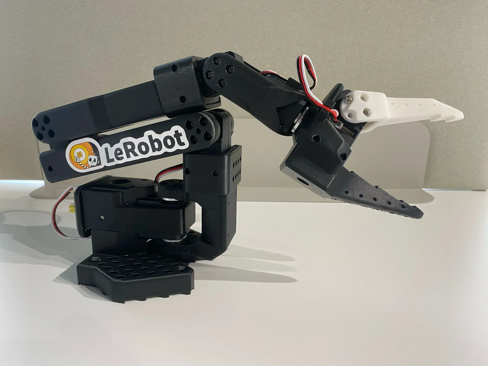
      <br><sub>SO-101 follower arm. Photo: <a href="https://github.com/TheRobotStudio/SO-ARM100">TheRobotStudio/SO-ARM100</a>, Apache-2.0.</sub>
    </td>
    <td valign="top">

**Arm.** An [SO-101](https://huggingface.co/docs/lerobot/so101) follower from [LeRobot](https://github.com/huggingface/lerobot), with six STS3215 servos. It only sets the viewpoint, then holds still while the mirror scans.

**Scanner head.** The spectrograph below, plus a first-surface scan mirror on a 60 g NEMA 8 stepper. A TMC2209 driver runs it at 1/32 microstepping from an ESP32, which takes plain-text commands from the Jetson over USB serial.

**Pose.** An RGB camera on the head sees an AprilTag board under the object.

**Light.** Halogen lamps, because LEDs give almost nothing past 700 nm.

**Compute.** A Jetson Nano for capture, the calibration warp and the CUDA splat renderer.

  </td>
  </tr>
</table>

## CAD model

<p align="center">
  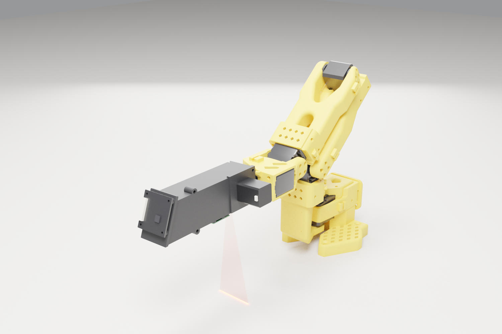
</p>

<table>
  <tr>
    <td width="50%">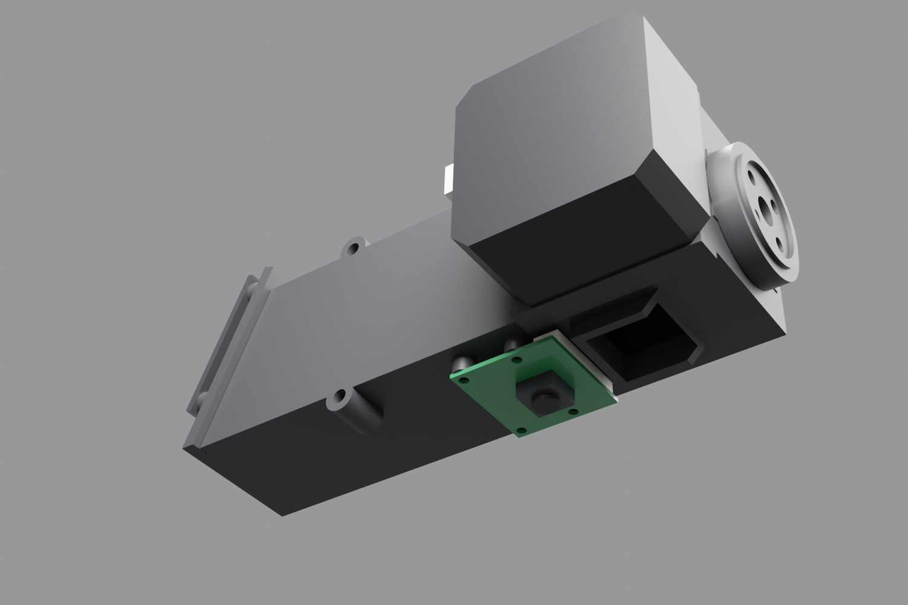</td>
    <td width="50%">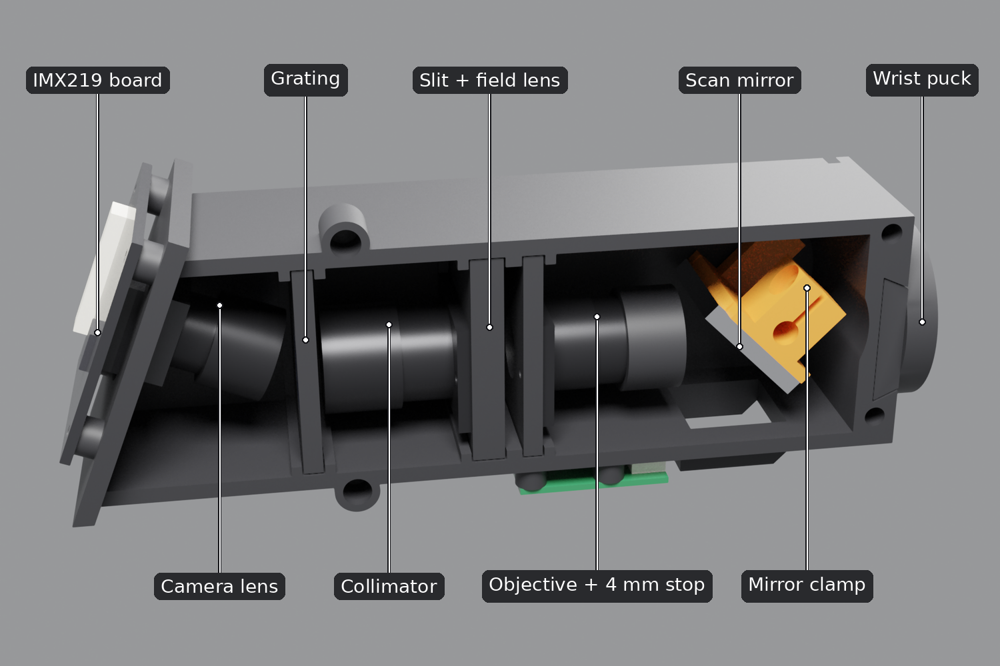</td>
  </tr>
  <tr>
    <td><sub>The head from below: scan window and hood, pose camera, NEMA 8 stepper, wrist puck.</sub></td>
    <td><sub>Lid and stepper hidden to show the optical train.</sub></td>
  </tr>
</table>

The whole rig is a parametric [FreeCAD model](cad/). One script builds the SO-101 from its URDF, reads the optical spacings from the Optiland model, and wraps the optics in a printable PETG housing that slides onto a puck on the wrist-roll servo. It checks the parts for clashes, the mirror's full turn and the wrist's clearance, and works out the servo load: the 185 g head needs 74% of the shoulder servo's stall torque with the arm stretched out level, and 18% in the folded scanning pose above. The STLs and assembly steps are in [`cad/`](cad/).

## Optical path

<p align="center">
  
</p>

A 16 mm f/4 objective images the object onto a 50 µm slit, so the instrument sees one line at a time. A field lens right behind the slit steers every point of that line toward the camera. A 25 mm lens, used backward, collimates the light, and a 500 lines/mm transmission grating fans it out by wavelength. A 12 mm f/2 lens, tilted 22° to the first diffraction order, refocuses the fan onto an IMX219 NoIR sensor, so each frame is one line of the object by its spectrum. A 500 nm long-pass filter in front keeps second-order light off the near-infrared end. Why each part is there: [final optical train](docs/parts_list_and_design.md#2-final-optical-train-config-c).

### What the camera sees

<p align="center">
  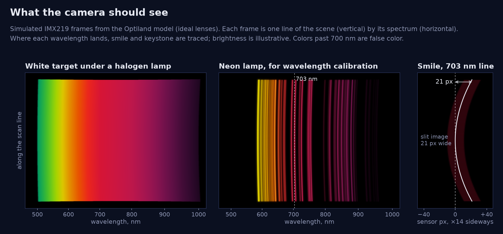
</p>

Each frame is the scan line (vertical) by its spectrum (horizontal), at about 5.8 px per nm. Spectral lines bow slightly across the frame (smile, up to about 33 px at the line ends) and the line length shifts a little with wavelength (keystone, about 11 px). Both get calibrated once with lamp lines and removed by a warp.

## Optiland model

[`optics/spectrograph_model.py`](optics/spectrograph_model.py) builds the whole train in [Optiland](https://github.com/HarrisonKramer/optiland) with ideal thin lenses and traces it. Tracing changed the design twice: the stock Pi NoIR lens was far too small to catch the collimated beam, and without a field lens most of the light from the ends of the line missed the camera lens.

<p align="center">
  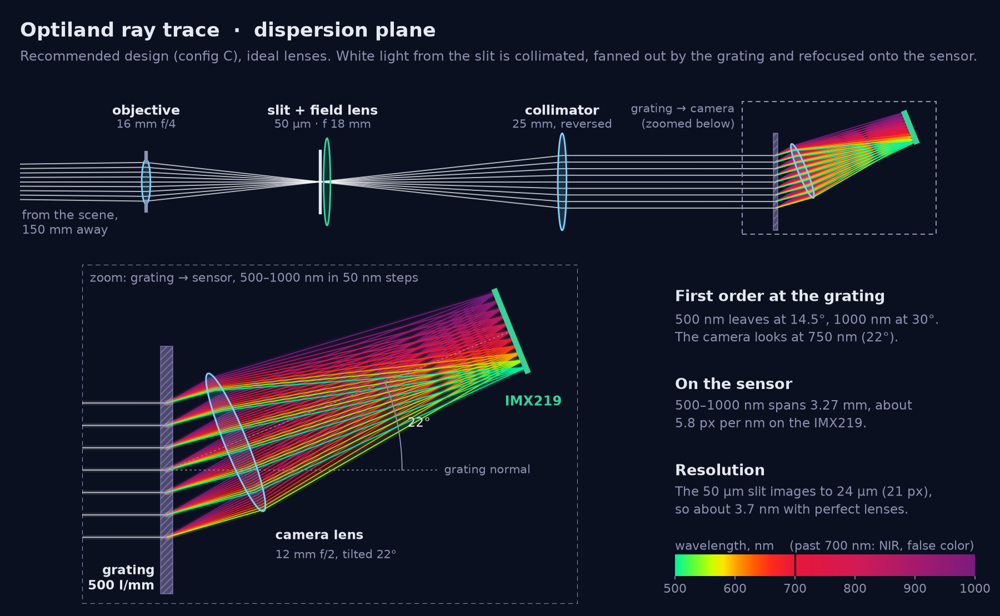
</p>

<p align="center">
  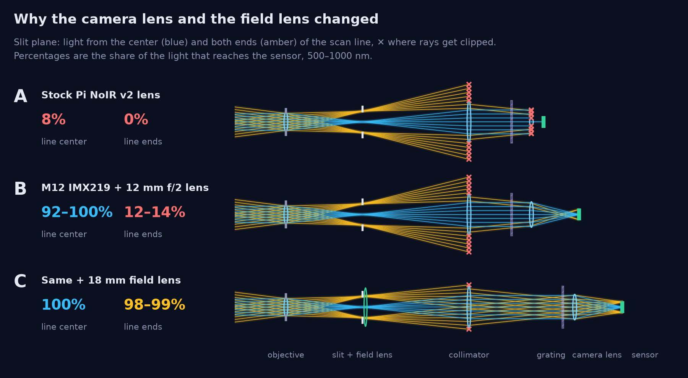
</p>

| Config (ideal lenses) | Light at line center | Light at line ends | Dispersion | Spectral resolution | Pixels along the line |
|---|---|---|---|---|---|
| A: stock Pi NoIR v2 lens | 8% | 0% | 1.5 px/nm | 3.7 nm | 543 |
| B: M12 IMX219 + 12 mm f/2 lens | 92–100% | 12–14% | 5.8 px/nm | 3.7 nm | 2,143 |
| **C: B + 18 mm field lens** | **100%** | **98–99%** | **5.8 px/nm** | **3.7 nm** | **2,204** |

Resolution is geometric, with perfect lenses; real M12 lenses will likely land around 5–8 nm. More in the [modeling notes](docs/parts_list_and_design.md#5-modeling-notes-and-limits).

```bash
pip install optiland                   # tested with 0.6.2
python optics/spectrograph_model.py    # prints the table, writes optics/model_output/
python optics/readme_figures.py        # redraws the Optiland figures in docs/img/
```

Full output: [`optics/model_output/results.txt`](optics/model_output/results.txt) and the [ray layouts](optics/model_output/).

## Software

<p align="center">
  
</p>

The rig isn't built yet, so every module is written and tested against simulated hardware: the firmware on a simulated rig, the ROS 2 side on a fake servo bus and a simulated mirror, the calibration kit on lamp frames rendered through the Optiland model, and the splat on a synthetic scan with known poses. The [instrument simulator](sim/) ties them together: a digital twin of the whole rig that renders complete scan sessions, raw frames and logged poses, from a scene whose spectra and geometry are known. GitHub Actions runs each module's checks on every pull request that touches it.

| Module | What CI checks | Status |
|---|---|---|
| [Scan-mirror firmware](firmware/) | Unit tests on a simulated rig, again under AddressSanitizer and UndefinedBehaviorSanitizer, and the ESP32 build | [](https://github.com/CoraBeanz/linescan-hyperspectral-splatting/actions/workflows/firmware.yml) |
| [ROS 2 scan arm](ros2/) | `colcon build` and `colcon test` in a ROS 2 Humble container, up to a two-viewpoint scan on mock hardware | [](https://github.com/CoraBeanz/linescan-hyperspectral-splatting/actions/workflows/ros2.yml) |
| [Calibration kit](calibration/) | The self-test and unit tests on Python 3.10 and 3.13, and the Jetson's capture commands on Python 3.6 and numpy 1.13 against a stand-in camera | [](https://github.com/CoraBeanz/linescan-hyperspectral-splatting/actions/workflows/calibration.yml) |
| [Line-camera splat](splat/) | CPU build and unit tests, and a small synthetic scan trained end to end; the CUDA build with CUDA 13.4 for a desktop GPU (CI has no GPU, so the GPU tests skip there) | [](https://github.com/CoraBeanz/linescan-hyperspectral-splatting/actions/workflows/splat.yml) |
| [Jetson Nano build](jetson/README.md) | The renderer and trainer built with the Nano's CUDA 10.2 and gcc 7.5 for sm_53, every kernel checked against the Nano's registers and shared memory, and the tests on arm64 Ubuntu 18.04 | [](https://github.com/CoraBeanz/linescan-hyperspectral-splatting/actions/workflows/jetson.yml) |
| [Splat viewer](viewer/) | The page's file reader, colour weights, spectra and WebGL2 image against the C++ renderer, then the page itself at a desktop and a phone size, in headless Chromium | [](https://github.com/CoraBeanz/linescan-hyperspectral-splatting/actions/workflows/viewer.yml) |
| [Instrument simulator](sim/) | The self-test, which scans a relief target, calibrates the simulated instrument and checks the reflectance against the truth, and the unit tests | [](https://github.com/CoraBeanz/linescan-hyperspectral-splatting/actions/workflows/sim.yml) |
| [CAD model](cad/) | Lint on the FreeCAD scripts | [](https://github.com/CoraBeanz/linescan-hyperspectral-splatting/actions/workflows/cad.yml) |
| [Optiland model](optics/) | Reruns the model and checks that its results, the CAD's as-built optics and the calibration kit's design map are current | [](https://github.com/CoraBeanz/linescan-hyperspectral-splatting/actions/workflows/optics.yml) |
| README and docs | The diagrams match the scripts that draw them, and every relative link resolves | [](https://github.com/CoraBeanz/linescan-hyperspectral-splatting/actions/workflows/docs.yml) |

Each module's README says how to build and test it locally, and its workflow in [`.github/workflows/`](.github/workflows/) runs the same commands.

### Scan-mirror firmware

<p align="center">
  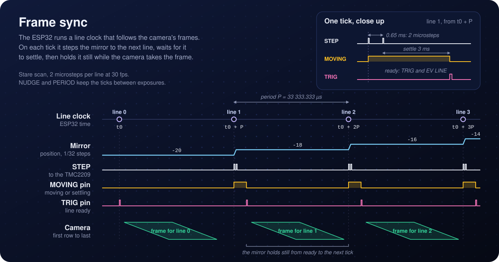
</p>

An ESP32 runs the mirror from a 50 µs timer interrupt and keeps a line clock that follows the camera's frames. In a stare scan it steps the mirror at each tick, waits for it to settle, and holds it still through the frame; in a sweep scan it turns the mirror at a constant speed and reports its exact position at each tick. Every line, move and hall-sensor edge is stamped in ESP32 microseconds, so each camera frame can be matched to a mirror angle. Homing finds the middle of a hall sensor's window, which repeats to a microstep, and the TMC2209's current and microstepping are set over its UART, with a watchdog that stops the motor on a driver fault.

The Jetson talks to it in [plain-text lines over USB serial](firmware/PROTOCOL.md) rather than micro-ROS, as first planned: there's no agent to run, any serial monitor can drive it, and a ROS 2 node turns it into topics and services. Wiring, first power-up and a bench test with a logic analyser are in [`firmware/`](firmware/).

### ROS 2 scan arm

ROS 2 Humble runs in Docker on the Jetson Nano, since JetPack 4 is Ubuntu 18.04. A ros2_control driver runs the SO-101's STS3215 servos at 100 Hz. For each viewpoint in a plan, `scan_sweep` moves the arm, waits for it to stop, and asks the mirror bridge for a sweep. The bridge maps the ESP32's clock onto ROS time, so each line gets the arm's joint angles at the moment the mirror settled. Through the URDF, which takes the head's geometry from the CAD model, those give the head pose and the line-camera pose: one row per line in `lines.csv`. With mock servos and a simulated mirror the whole stack runs on any Linux machine with Docker, and Foxglove draws every scan line where it lands. Setup on the Nano and first steps with the real arm: [`ros2/`](ros2/README.md).

### Calibration

<p align="center">
  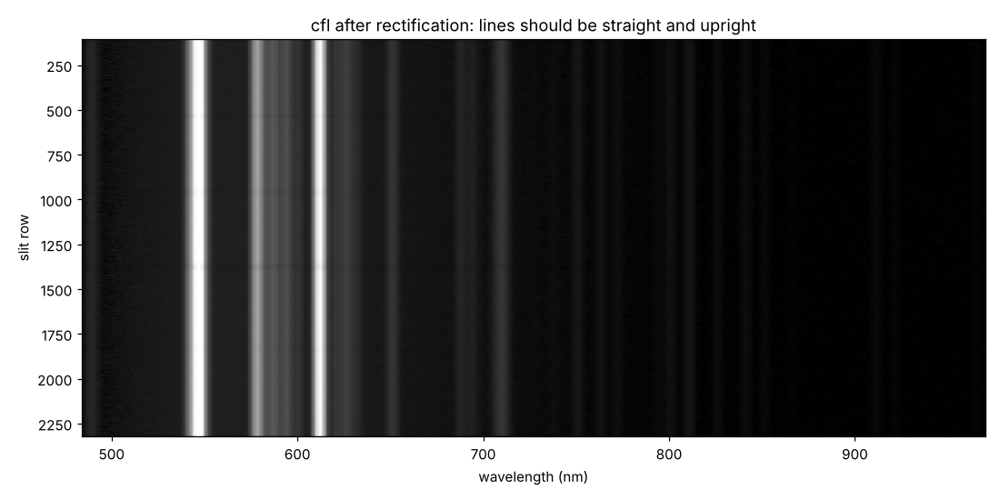
  <br><sub>A synthetic CFL frame after calibration. On the sensor these lines bow by up to 35 px; here each one is a straight column at its own wavelength.</sub>
</p>

About ten minutes of lamp frames calibrate the spectrograph. A CFL bulb and a neon glow lamp give about 100 lines from 490 to 970 nm, a halogen lamp on PTFE gives the slit's ends and the spectral response, and a red laser pointer checks the result. The calibration kit, `hsical`, fits the wavelength of every pixel, the warp that straightens the bowed lines (smile) and evens out the slit's length across wavelengths (keystone), and the response that turns counts into radiance or reflectance, then writes a report with pass/fail checks. Its capture commands run on the Jetson's stock Python 3.6; the fitting runs on a PC.

Without the hardware, it is tested on sessions rendered through the Optiland model from a deliberately imperfect copy of the design: shifted on the sensor, with a denser grating, barrel distortion, dust on the slit, the sensor's colour mosaic and noise. At full resolution it recovers the truth to:

| Error against the truth | Result | Limit |
|---|---|---|
| Wavelength of every pixel, rms | 0.020 nm | 0.10 nm |
| Wavelength of every pixel, worst | 0.070 nm | 0.30 nm |
| Laser wavelength | 0.003 nm | 0.20 nm |
| Reflectance of a test scene, rms | 0.8% | 3% |

First light step by step, and how each fit works: [`calibration/`](calibration/).

### Instrument simulator

<p align="center">
  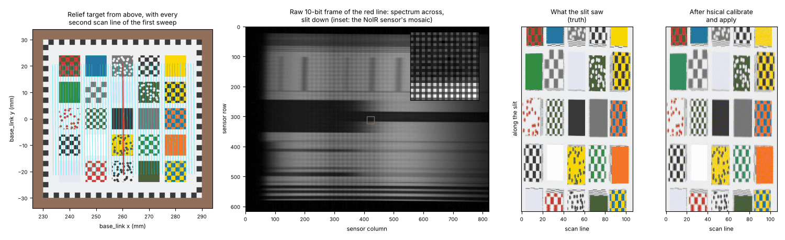
  <br><sub>The relief target with every second line of the first sweep, the raw frame of the red line, and the whole sweep as the slit really saw it next to what the calibration kit made of the raw frames.</sub>
</p>

The [simulator](sim/) is a digital twin of the whole scanner: the arm, the scan mirror, the objective and slit, the spectrograph and its camera. Given a scene with known spectra and a scan plan, it renders the raw frame of every scan line and writes a complete session in the rig's own format, with the arm's servo offsets, flex and encoder steps and the mirror's homing error in the log, as the real rig's will have them. Most of it is the repo's own code, imported rather than copied: the URDF's kinematics from the ROS 2 package, the synthetic spectrograph from the calibration kit, and the Optiland design map. Its self-test calibrates the simulated instrument, turns two sweeps of a relief target into reflectance and checks them against the truth: 1.6% RMS reflectance error, and the absorption bands of a rare-earth tile within 0.07 nm.

### On the Jetson Nano

The Nano is stuck on JetPack 4.6: Ubuntu 18.04, CUDA 10.2 and gcc 7. [`jetson/`](jetson/README.md) builds splat for its GPU in a container that uses JetPack's own CUDA, and builds the ROS 2 image in a way JetPack's old Docker can manage. A day-one script builds and tests both and times training on the GPU. From a PC, the same scripts build splat with the Nano's compilers, check that every kernel fits the Nano's registers and shared memory, and run the tests on arm64 Ubuntu 18.04.

## Reconstruction

Published hyperspectral splatting, such as [HyperGS](https://openaccess.thecvf.com/content/CVPR2025/papers/Thirgood_HyperGS_Hyperspectral_3D_Gaussian_Splatting_CVPR_2025_paper.pdf) and [DD-HGS](https://arxiv.org/abs/2505.21890), trains on full multi-view hyperspectral images. Here the splat trains straight from raw scan lines, through a model of the instrument itself.

- **Spectral Gaussians.** Each Gaussian keeps the usual position, shape and opacity, and stores a spectrum over 500–950 nm where a normal splat stores RGB.
- **A line camera, not a pinhole.** The slit only sees a thin fan of rays, and the mirror angle tilts that fan. For each scan line, the renderer draws the splat along that one fan and compares the resulting line of spectra with the measured line.
- **Poses get refined too.** The arm and the tag board give each viewpoint a pose, and the optimizer can adjust those poses along with the Gaussians, so small arm errors don't blur the result.
- **Calibrated input.** Neon and CFL lamp lines fix the wavelength scale, the warp removes smile and keystone, and a white PTFE reference turns counts into reflectance.

Splatting through a non-pinhole camera has precedent in satellite imagery ([RPC-GS](https://arxiv.org/abs/2606.06690)), and close-range pushbroom cameras have been calibrated for plant phenotyping ([Behmann et al. 2015](https://doi.org/10.1016/j.isprsjprs.2015.05.010)). This project puts the two together on hobby hardware.

### Training on a synthetic scan

The renderer and trainer in [`splat/`](splat/) are C++17, with a CUDA rasterizer written for the Nano's CUDA 10.2 and a CPU reference that the tests hold it to. Until there are real scans, they train on a synthetic one: a board with paint patches, a hidden word that only shows past 740 nm, a leaf-green ball and an orange box, scanned through the head's mirror geometry from the CAD model. Each sweep's head pose is off by about 1 mm and 0.3° per axis, as the arm's will be.


The true scene (left), and splats trained from 16 sweeps (middle) and from 8 (right). From 16 sweeps the trainer cuts the pose error from 10.9 px to 0.97 px at 256 px per line, which lines the sweeps up to about 0.15 mm on the board, and it renders the measured lines down to their noise. That takes 16 s on a desktop RTX 4070 SUPER, or under two minutes on a 4-core CPU. From 8 sweeps the ball and the box are seen from too few directions and get painted onto the board, so the rig will scan many sweeps from all around. The model, the CUDA passes and more results are in [`splat/`](splat/).

### In the browser

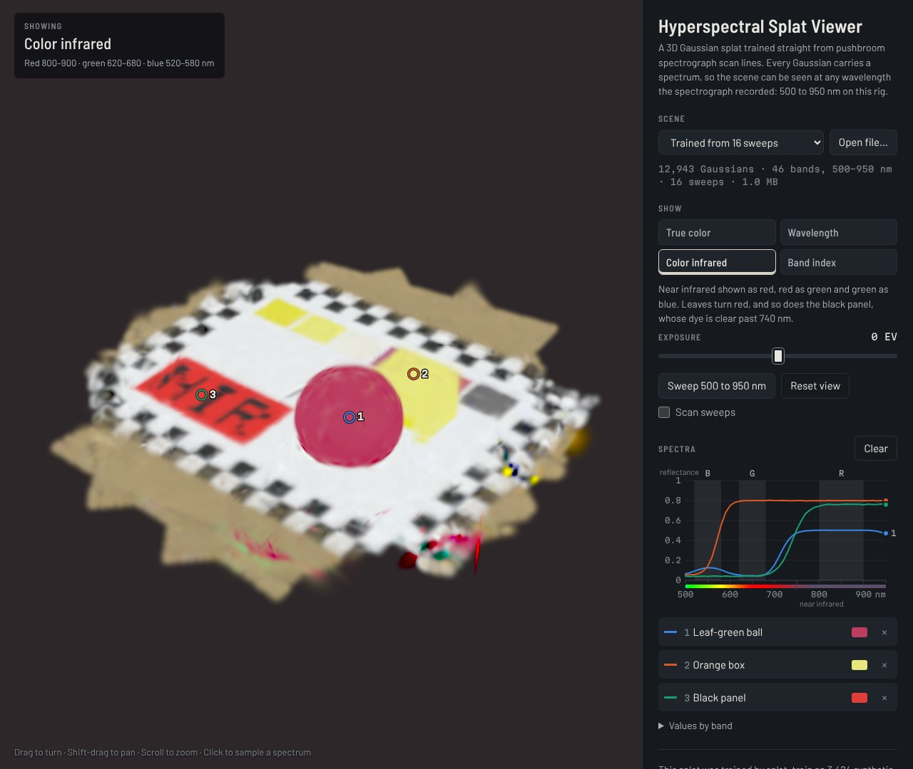

Every Gaussian carries a spectrum, so the [viewer](viewer/) can draw a trained splat at any single wavelength, in true color, in color infrared, or as a band index such as NDVI, and it plots the full spectrum of any point you click. Above, in color infrared, the ball's leaf spectrum and the black panel's dye both rise past 700 nm, so both turn red and the hidden word shows. It is plain HTML, JavaScript and WebGL2 with no build step, and its tests check it against the C++ renderer.

## Roadmap

- [x] First-order optical design and Optiland model (configs A, B, C)
- [x] [FreeCAD model](cad/) of the arm and scanner head, with printable housing, optics carriers and wrist mount
- [x] [Software](#software), tested in CI against simulated hardware: scan-mirror firmware, ROS 2 scan arm, calibration kit, line-camera splat renderer and trainer, browser viewer, the Jetson Nano build and an instrument simulator
- [ ] **Bench spectrometer:** slit, field lens, collimator, grating and camera aimed at neon and CFL lamps; fit the wavelength map and the smile/keystone warp with the [calibration kit](calibration/)
- [ ] **Line imager:** add the objective, focus it on a printed target, measure the line on a knife edge
- [ ] **Scanner:** add the mirror and stepper, scan a color card, assemble the datacube on the Jetson (first CUDA kernel: warp + bin)
- [ ] **3D:** arm viewpoints and AprilTag poses, then the first splat trained on real scans

Details for each step are in the [build order](docs/parts_list_and_design.md#4-build-order).

## Stack

| Layer | Built with |
|---|---|
| **Optics** | Python and [Optiland](https://github.com/HarrisonKramer/optiland): ideal-lens model now, catalog lenses next |
| **CAD** | [FreeCAD](https://www.freecad.org/), scripted in Python around the SO-101's URDF |
| **Firmware** | C++ on an ESP32 (Arduino core, PlatformIO) driving a TMC2209, with Unity tests on a simulated rig |
| **Robotics** | ROS 2 Humble in Docker on the Jetson Nano: a ros2_control driver for the STS3215 servos, the URDF and the scan sweeps |
| **Capture and calibration** | Python, numpy and scipy; raw 10-bit frames from the IMX219 NoIR on the Jetson Nano's CSI port, through V4L2 |
| **Reconstruction** | C++17 and CUDA: line-camera Gaussian splat renderer and trainer for the Jetson Nano |
| **Viewer** | Plain HTML, JavaScript and WebGL2, tested in headless Chromium with Playwright |
| **Simulation** | Python and numpy, reusing the calibration kit's and the ROS 2 packages' own code |
| **CI** | GitHub Actions, a workflow per module |

## Repo map

```
docs/
├── parts_list_and_design.md   parts with vendors and prices, first-order design, build order
├── optical_train_v2.svg       optical train drawing (v1 kept alongside)
└── img/                       README figures; img/src/ holds the scripts that draw the SVGs
optics/
├── spectrograph_model.py      Optiland model of the spectrograph, configs A–C
├── readme_figures.py          traces the model and renders the Optiland figures
└── model_output/              results.txt and ray layouts
cad/
├── so101_hsi_rig.FCStd        FreeCAD assembly: SO-101 arm and scanner head
├── build_rig.py               builds it, checks clearances and servo load, exports
└── stl/, step/, renders/      printable parts, the head as STEP, images
firmware/
├── lib/scanmirror/            step generator, line clock, commands, homing: plain C++
├── src/main.cpp               the ESP32 glue
├── test/                      Unity tests on a simulated rig
└── PROTOCOL.md                the serial protocol
ros2/
├── so101_scan_*/              ROS 2 Humble packages: driver, URDF, bringup, sweeps, messages
└── docker/, udev/             the container for the Jetson Nano, stable device names
calibration/
├── hsical/                    capture, calibration, reports: python -m hsical
└── tests/                     pytest on synthetic sessions
splat/
├── include/, src/             line-camera renderer (CPU and CUDA) and trainer
├── tools/                     splat_synth, splat_train, splat_render, splat_export
└── tests/                     unit tests; the CUDA ones skip without a GPU
viewer/
├── index.html, js/            the browser viewer: WebGL2, no build step
├── data/                      two splats from the synthetic scan
└── test/                      checks against the C++ renderer, run in headless Chromium
sim/
├── hsisim/                    the instrument simulator: python -m hsisim
└── tests/                     pytest, up to a scan calibrated end to end
jetson/
├── build_all.sh, splat.sh     the Nano's day-one build, splat in its container
├── ros.sh                     the ROS 2 image on JetPack 4.6's Docker
└── check.sh                   the same builds from a PC, with the Nano's compilers
.github/workflows/             CI, a workflow per module
```

## Background reading

- Kerbl et al., [3D Gaussian Splatting for Real-Time Radiance Field Rendering](https://repo-sam.inria.fr/fungraph/3d-gaussian-splatting/), ACM TOG (SIGGRAPH) 2023. [arXiv:2308.04079](https://arxiv.org/abs/2308.04079)
- Thirgood et al., [HyperGS: Hyperspectral 3D Gaussian Splatting](https://openaccess.thecvf.com/content/CVPR2025/papers/Thirgood_HyperGS_Hyperspectral_3D_Gaussian_Splatting_CVPR_2025_paper.pdf), CVPR 2025
- Narayanan et al., [Diffusion-Denoised Hyperspectral Gaussian Splatting](https://arxiv.org/abs/2505.21890) (first posted as *Hyperspectral Gaussian Splatting*), arXiv 2025
- Wagner et al., [RPC-GS: Gaussian Splatting with native RPC Rendering for Satellite Imagery](https://arxiv.org/abs/2606.06690), arXiv 2026
- Behmann et al., [Calibration of hyperspectral close-range pushbroom cameras for plant phenotyping](https://doi.org/10.1016/j.isprsjprs.2015.05.010), ISPRS Journal of Photogrammetry and Remote Sensing 106, 2015

## Credits

- SO-101 photo: [TheRobotStudio/SO-ARM100](https://github.com/TheRobotStudio/SO-ARM100) (`media/SO101_Follower.webp`), used unmodified under the Apache License 2.0; a copy of the license is in [`docs/img/SO-ARM100_LICENSE.txt`](docs/img/SO-ARM100_LICENSE.txt). The SO-101 is designed by The Robot Studio in collaboration with Hugging Face.
- SO-101 URDF and meshes in the CAD model: [TheRobotStudio/SO-ARM100](https://github.com/TheRobotStudio/SO-ARM100) (`Simulation/SO101`), Apache License 2.0.
- Ray tracing: [Optiland](https://github.com/HarrisonKramer/optiland) (MIT).
