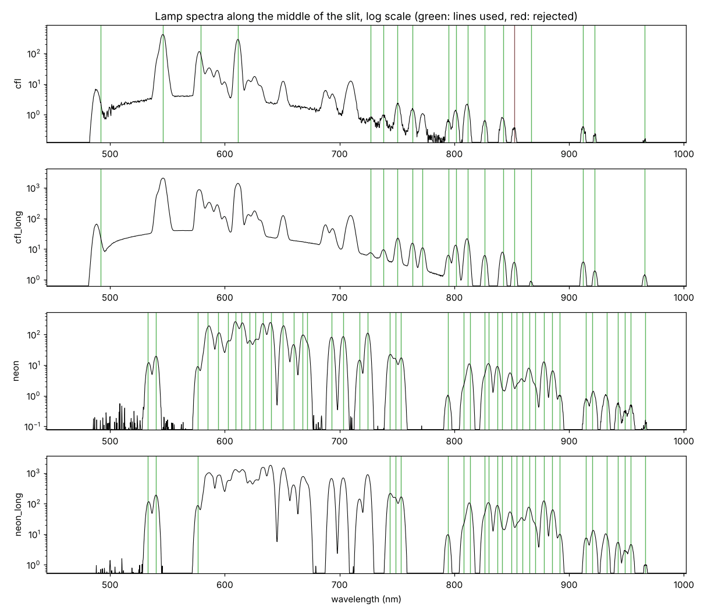

# Spectrometer calibration kit

`hsical` turns raw frames from the spectrograph into calibrated spectra. One session of lamp frames, about ten minutes with a CFL bulb, a neon outlet tester, a halogen lamp on PTFE and a red laser pointer, gives:

- the **wavelength of every pixel**, from about 100 lamp lines between 490 and 970 nm;
- the **warp** that straightens the curved lamp lines (smile) and evens out the slit's length across wavelengths (keystone);
- the **spectral response**, so a frame becomes radiance, or reflectance against a white reference;
- a **report** with pass/fail checks, plots, and what to do when a check fails.

The parts haven't arrived yet, so the kit is built and tested on synthetic frames rendered through the [Optiland model](../optics/spectrograph_model.py). `python -m hsical selftest` renders a session from a deliberately imperfect copy of the design, calibrates it, and compares the result with the answer the frames were built from.

The other calibration here, [`headcal`](headcal/README.md), measures where the scanner head's cameras and mirror really sit on the wrist, from one scan of a printed tag board, and writes them into the URDF and the trainer's head model.

<p align="center">
  
  <br><sub>A synthetic CFL frame after calibration. On the sensor these lines bow by up to 35 px; here each one is a straight column at its own wavelength.</sub>
</p>

## Contents

- [What you need](#what-you-need)
- [Install](#install)
- [First light, step by step](#first-light-step-by-step)
- [Reading the report](#reading-the-report)
- [Using a calibration](#using-a-calibration)
- [Checking for drift](#checking-for-drift)
- [How it works](#how-it-works)
- [Testing without the hardware](#testing-without-the-hardware)
- [Limits](#limits)
- [Code map](#code-map)

## What you need

| Item | What it calibrates | Notes |
|---|---|---|
| CFL bulb, any compact fluorescent | wavelength: mercury, argon and phosphor lines from 490 to 970 nm | Let it warm up for 2 to 3 minutes first. |
| Neon glow lamp: the Sperry GFI6302N outlet tester, or a bare NE-2 | wavelength: dozens of neon lines from 533 to 967 nm | It must glow orange; an LED tester won't work. |
| Halogen lamp (the HDX work light) and a PTFE sheet | slit ends, keystone, spectral response | A filament is close to a blackbody, so its spectrum is known. |
| 3 to 5 thin wires, 0.1 to 0.3 mm | keystone along the slit | Guitar string, magnet wire or a hair. |
| Red diode laser | a check that the smile correction worked | Not a wavelength reference: a diode's wavelength drifts a few nm with temperature. |
| Lens cap or black cloth | darks | |

**Safety.** The outlet tester runs on mains voltage: hold it by its plastic body, never open it, and plug it in only while capturing. Never point the laser into the optics or anyone's eyes; aim it at the PTFE so the slit sees the diffuse spot. Halogen bulbs get hot enough to burn and to scorch the PTFE, so keep a few centimetres between them. A CFL holds a little mercury; if one breaks, air the room out before cleaning up.

## Install

**PC** (Windows, Linux or macOS, Python 3.10 or newer), from this folder:

```bash
pip install -r requirements.txt
python -m hsical selftest        # renders, calibrates and checks a small synthetic session: under a minute
```

**Jetson Nano** (JetPack 4: its stock Python 3.6 and numpy are enough). Copy this folder over, or clone the repo, then:

```bash
sudo apt install v4l-utils python3-numpy
cd calibration
python3 -m hsical probe          # lists the camera's formats and controls
```

Look for the `RG10` format at 3264 x 2464 and the `exposure`, `gain` and `frame_rate` controls. If your driver names them differently, pass the names with `--ctrl`, for example `--ctrl exposure_ctrl=exposure_time_absolute`. Every capture command accepts `--dry-run`, which prints the `v4l2-ctl` command line instead of running it. A Raspberry Pi works too: the kit uses picamera2's raw stream there.

Raw frames matter. The normal camera pipeline (`nvarguscamerasrc`, libcamera's processed output) demosaics, white-balances and applies a tone curve, and all of that bends the numbers. The capture commands read the sensor's own 10-bit values.

## First light, step by step

### 1. Look at a lamp frame

With the CFL lit in front of the slit, the frame should show bright vertical lines. The spectrum runs along the sensor's long side, blue on the left, and the slit runs top to bottom between rows 123 and 2340. A camera mounted on its side or flipped is fine: the kit finds out from the frames and turns them.

Where the design puts the brightest lines, in the middle of the slit, counting columns across the full 3280-px width (the Jetson's 3264-px mode trims a few):

| Line | nm | Column | Lamp |
|---|---|---|---|
| Mercury, green | 546.1 | 480 | CFL, the brightest line |
| Neon | 585.2 | 700 | neon |
| Europium phosphor, red | 611.4 | 848 | CFL, second brightest |
| Neon | 640.2 | 1011 | neon, one of the brightest |
| Red laser | about 650 | about 1067 | laser |
| Neon | 703.2 | 1371 | neon |
| Argon | 763.5 | 1718 | CFL, long exposure |
| Argon | 811.5 | 1998 | CFL, long exposure |
| Argon | 912.3 | 2599 | CFL, long exposure |
| Neon | 966.5 | 2931 | neon, long exposure |

A real build will sit a hundred pixels or so away from these columns, which is fine. What should match is the pattern: the two brightest CFL lines are about 370 px apart. The design spreads 5.6 px per nm at 500 nm and 6.3 px per nm at 1000 nm, and a line is about 24 px wide, which works out to 4 nm of spectral resolution.

### 2. Focus

```bash
python3 -m hsical focus --exposure-ms 20
```

With the CFL lit, this prints the width of the brightest line, frame after frame. Turn the camera lens slowly and stop at the smallest number. The slit's own image is 23 to 24 px wide, so the width can't go below that. Perfect lenses would get within a pixel or two of it; real M12 lenses will probably bottom out somewhere around 30 to 45 px, which is 5 to 8 nm of resolution. What matters is finding the minimum. Keep the peak level the command prints between 40% and 90% by changing `--exposure-ms`. The camera lens can only fix its own focus: the collimator has to sit one focal length (25 mm) from the slit, as the printed housing holds it. If the minimum is broad and high, check that spacing first.

### 3. Capture a session

```bash
python3 -m hsical plan ~/sessions/first_light
```

This walks through each setup in turn, waits for Enter, sets the exposure on its own, and shows the peak level and saturation after every set; `r` retakes a set. At the end it takes darks at every exposure and gain it used.

| Set | Setup | Exposure | What it gives |
|---|---|---|---|
| `flat` | Halogen on the PTFE, the sheet filling the slit's view | 75% of full scale | Slit ends, keystone, spectral response, the colour mosaic's pattern |
| `wires` | Same light, with 3 to 5 wires across the PTFE, spread along the slit | Same as the flat | Dark notches at fixed points along the slit, for the keystone |
| `cfl` | CFL in front of the slit, room lights off | 75% | Mercury and phosphor lines |
| `cfl_long` | Same | 10x longer | The faint argon lines from 700 to 970 nm; the bright lines saturate on purpose |
| `neon` | Neon lamp right at the slit | 75% | Neon lines from 533 to 750 nm |
| `neon_long` | Same | 10x more light (gain goes up past 650 ms) | Neon lines from 750 to 967 nm |
| `laser` | Red laser spot or line on the PTFE | 60% | A check of the smile correction |
| `dark_*` | Lens capped or slit covered, lamps off | Each exposure and gain used above | Black level and hot pixels |

On the bench, before the objective is fitted, hold a piece of PTFE against the slit with the halogen shining through it, and lay the wires straight across the slit. Once the objective is in, the PTFE and wires go where the scan line falls, in focus. Each set is 16 frames (8 for the laser); at full resolution a whole session comes to about 3 GB, and `--frames 8` halves that. `--steps flat,wires` retakes only those sets.

### 4. Copy the session to the PC and check it

```bash
scp -r <user>@<jetson-address>:sessions/first_light .
python -m hsical inspect first_light
```

`inspect` lists each set with its exposure, gain, peak level, saturation and matching dark. It flags anything that would stop a calibration (no lamp set, a saturated flat, sets of different frame sizes) and notes anything that would weaken one (a missing dark or long set, an exposure that's too faint).

### 5. Calibrate

```bash
python -m hsical calibrate first_light -o cal
```

At full resolution this takes one to two minutes and 2.5 GB of memory. It writes `cal/report.md` with its plots, `cal/calibration.json` and `cal/maps.npz`, and exits with code 2 if a check fails. Options worth knowing: `--temp-k` sets the halogen's filament temperature (2850 K by default), `--nm-step` sets the wavelength step of the output (2 nm by default), and `--lamps cfl,neon` leaves out sets you don't trust.

If the line pattern ever matches the wrong way, so that the lamp plot's ticks sit beside the peaks instead of on them, tell the kit where one line is. Add a `session.json` to the session folder with the column of the bright green mercury line, counted with blue on the left: `{"hints": {"cfl": [[546.07, 572]]}}`.

## Reading the report

`report.md` opens with a table of checks:

| Check | Passes when | If it fails |
|---|---|---|
| flat exposure | Under 0.01% of the flat's pixels saturated | Retake the flat shorter: `plan --steps flat,wires`. |
| wavelength fit | Under 0.3 nm rms, with 8 or more lines | Refocus, check the lamp exposures, and look in the line table for lines with large residuals. |
| lines cover the band | Lines from below 560 nm to above 850 nm | Retake the long neon and CFL sets. |
| smile fit | Residuals under 0.3 line widths, with 6 or more lines followed | The lines are too faint near the slit's ends: light the whole slit evenly, or expose longer. |
| keystone fit | Under 0.5 px | The flat is uneven; look at the slit ends in the keystone plot. |
| slit evenness | No dips over 3%, under 15% brighter at one end than the other | A note, never a failure. Dips are usually dust on the slit; blow it clean. The response map corrects whatever remains. |
| laser straight along the slit | Under 0.15 nm rms | The smile correction is off; look at the traces in the smile plot. |

Under the checks come the numbers worth tracking from one build or session to the next: wavelength range, dispersion in px per nm, line width and resolution in nm, how far the lines bow at the slit's ends, where the slit ends are, the usable band, and the laser's measured wavelength. Then come the plots:

<p align="center">
  
  <br><sub>Synthetic lamp spectra along the middle of the slit, on a log scale. Each green tick is a catalog line the wavelength fit used, and red ones were rejected. The long sets saturate the bright lines and bring up the faint ones past 750 nm.</sub>
</p>

At the end of the report, the lamp-line table lists every line the fit tried: its catalog wavelength, measured column and uncertainty, signal-to-noise, how many neighbouring lines were fitted with it, and how far it lands from the final curve. The log of the run comes last.

## Using a calibration

**From the command line.** Capture frames of something, a white PTFE reference under the same light, and a dark, then turn them into spectra:

```bash
# on the Jetson
python3 -m hsical capture scans leaf --kind scene --exposure-ms 30
python3 -m hsical capture scans white --kind white --source ptfe --exposure-ms 30
python3 -m hsical capture scans dark_30ms --kind dark --exposure-ms 30
# on the PC
python -m hsical apply cal scans/leaf --dark scans/dark_30ms                       # radiance
python -m hsical apply cal scans/leaf --dark scans/dark_30ms --white scans/white   # reflectance
```

Each writes `spectra/leaf_radiance.npy` (or `_reflectance`), a float32 array of frames x slit rows x wavelengths, along with a `.json` file holding the wavelength and slit axes and a `.png` preview. `--dark 64` subtracts the sensor's black level when no dark was taken.

**From Python:**

```python
from hsical.model import Calibration

cal = Calibration.load("cal")
line = cal.radiance(raw, dark, exposure_us=30000)      # (slit rows, wavelengths)
refl = cal.reflectance(raw, dark, 30000, white, white_dark, 30000)
cal.nm_grid, cal.s_grid                                 # the axes of both
cal.wavelength_at(x, y)                                 # nm at any pixel
```

**From C++ or CUDA.** `maps.npz` is a plain numpy archive; [cnpy](https://github.com/rogersce/cnpy) reads it, or re-save the arrays as raw float32. It holds:

| Array | Shape | Meaning |
|---|---|---|
| `map_x`, `map_y` | slit rows x wavelengths | The sensor pixel to sample, bilinearly, for each output cell: the same convention as OpenCV's `remap`, so the warp is one gather kernel. |
| `nm_grid`, `s_grid` | 1-D | Wavelength (nm) of each output column and slit row of each output row. |
| `wavelength`, `slit` | sensor rows x columns | Wavelength and slit position of every raw pixel, for a renderer that models raw pixels instead of resampled cells. |
| `response` | sensor rows x columns | Counts per second, at gain 1, per unit of relative radiance. |
| `bad` | sensor rows x columns | Hot and dead pixels to skip. |

All of these are in the turned frame: spectrum along x, blue on the left. If `sensor.orientation` in `calibration.json` isn't all `false`, turn each raw frame the same way first: transpose, then mirror x, then mirror y. One output cell spans several pixels (a 2 nm step is about 12 columns), so average over a cell before sampling: a box as wide as the step along x, and a [1 2 1] filter along the slit, as `Calibration.rectify` does. For radiance, warp the dark-subtracted counts per second and the response map that way separately, then divide one by the other. Dividing first lets the colour mosaic's dim pixels through as noise.

## Checking for drift

A printed housing shifts a little with temperature and handling, and a knock can move the slit or the camera. Before a scanning session, take one CFL set (or neon) and a dark in the sensor mode the calibration was made in, and check it against the calibration:

```bash
# on the Jetson
python3 -m hsical capture checks cfl --kind lamp --source cfl --exposure-ms 60 --frames 4
python3 -m hsical capture checks dark_60ms --kind dark --exposure-ms 60 --frames 4
# on the PC
python -m hsical check cal checks/cfl
```

`check` fits every lamp line the calibration used, in five bands along the slit and the way `calibrate` fitted it, and compares where each one is with where the calibration puts it. It also finds the slit's two ends along the brightest lines. On a synthetic session, a fresh CFL set of the calibrated instrument reads:

```
  wavelength offset    +0.036 nm (+0.04 px; + means the lines moved toward red)
  along the slit       -0.047 nm end to end (camera or slit turned)
  across the spectrum  +0.021 nm blue to red (grating or camera lens moved)
  worst anywhere       +0.070 nm, limit 0.2   ok
  lines about the fit  0.042 nm rms (weighted), 0 outlier(s) left out
  slit ends            -0.21 / +0.15 rows (top / bottom), -0.005% of the slit, limit 0.2%   ok
Still calibrated: the lines are where the calibration puts them.
```

The offset, the tilt along the slit and the stretch across the spectrum make a plane through every line's shift; "worst anywhere" is that plane's largest value over the sensor, against a limit of 0.2 nm. The slit ends catch a move along the slit, which the lines alone can't see. With the same instrument knocked by 1.5 px along the spectrum and 2 rows along the slit, it reads an offset of 1.54 px and slit ends of +1.8 and +2.2 rows, and says to recalibrate.

It exits with 0 when the instrument is still calibrated and 2 when it has moved, so a scan script can stop first. `--dark` names the dark (it finds a matching one beside the frames otherwise, or subtracts the black level of 64), `--source` names the lamp for a frame file without a `meta.json`, `--max-nm` and `--max-slit-percent` change the limits, and `--json` saves every line's shift.

## How it works

**Sensor.** Each set is averaged over its frames, and the dark at the same exposure and gain is subtracted. Without an exact match, the kit interpolates between darks at nearby exposures, and with no darks at all it subtracts the black level of 64 counts. Hot pixels are found in the longest dark, odd ones in the flat, and both get filled in from same-coloured neighbours. The NoIR IMX219 has no infrared-cut filter but still has its red, green and blue dyes. Below about 800 nm, neighbouring pixels see up to ten times different amounts of the same light; past 800 nm the dyes go clear and the mosaic fades out. The kit measures that pattern from the flat and evens it out before looking for lines.

**Wavelength.** Lamps emit at fixed wavelengths, listed in the [NIST Atomic Spectra Database](https://physics.nist.gov/asd): mercury and argon in a CFL, neon in a glow lamp, plus the peaks of the CFL's europium and terbium phosphors. The kit first slides and stretches the spectrum predicted from the design along the measured one until the line patterns match, so it knows which bump is which line even if the camera sits well off its designed position. At this resolution, lines closer than about 5 nm merge into one bump. Where that bump peaks depends on how bright each line is, and no catalog knows that for your particular lamp. So each bump is fitted as its known set of lines, with their spacings fixed and their brightnesses free. Phosphor bands, which are broad and only roughly catalogued, get free positions too. Those fits need the right line shape: the slit's flat-topped image, softened by the lens blur. A line on its own can't tell a wide slit image with little blur from a narrow one with a lot, but overlapping lines can, so the kit tries a range of widths and splits on the strongest groups and keeps the one they fit best. In the synthetic tests with a soft lens, the wrong shape moved some lines by more than a nanometre. The column-to-wavelength curve is the design's curve plus a gentle cubic correction, fitted to every line weighted by its uncertainty, and lines that miss by more than 4 sigma are dropped. The near-infrared lines are tens to hundreds of times fainter than the bright visible ones, and the sensor loses sensitivity past 800 nm, so the long sets let the bright lines saturate to bring the faint ones up; saturated columns are skipped.

**Smile.** Light from the ends of the slit reaches the grating slightly out of the plane it disperses in, and diffracts a little further (conical diffraction). So each lamp line is a gentle arc, with its ends 15 to 32 px further toward the red than its middle. The kit follows dozens of lines from the middle of the slit to its ends and fits a smooth surface that gives each pixel's offset.

**Keystone.** The slit's image is not the same length at every wavelength, because the camera lens magnifies a little differently across the band; in the design it is about 20 px longer at the ends of the band than in the middle. The ends of the slit in the flat, and the wires' shadows, mark fixed points along the slit at every wavelength. A second smooth surface maps each pixel to its position along the slit.

**Rectification.** Together, the two surfaces say which wavelength and which slit point every pixel sees. Inverting that once gives a lookup table, `map_x` and `map_y`, that resamples a frame onto a regular grid: one row per slit point and one column per wavelength step, with every lamp line straight. On the Jetson this is a single gather kernel per frame.

**Spectral response.** A halogen filament glows close to a blackbody at about 2850 K, so Planck's law gives its spectrum. Dividing the flat by that spectrum gives the response: counts per second, per pixel, per unit of light at that pixel's wavelength. It folds in the filter, the grating's efficiency, the lenses, the sensor's sensitivity and the colour dyes. Radiance is then counts divided by response, in units of that blackbody normalised to 1 at 700 nm. Reflectance, the scene's counts divided by a white PTFE reference's under the same lamp, needs no response and no filament temperature at all. Reflectance is what the splat trains on.

## Testing without the hardware

[`tools/export_optiland_map.py`](tools/export_optiland_map.py) traces the Optiland model, at the spacings the CAD model actually builds and with the 15 mm Edmund field lens, and records where each point of the slit lands on the sensor at each wavelength. The result, [`hsical/data/optiland_map.json`](hsical/data/optiland_map.json), is used two ways: as the starting guess for which column sees which wavelength, and to render synthetic sessions.

```bash
python -m hsical synth synth_session --binning 2     # 1 = full 3280 x 2464, 2 = half, 4 = quarter
python -m hsical calibrate synth_session -o synth_cal
```

The synthetic instrument is deliberately not the design. Its spectrum is shifted and rotated on the sensor, its grating is 1.2% denser, and its lens has some barrel distortion and blur. Its lamps' line brightnesses scatter around the catalog's, its slit has dust and a tapered width, and its sensor has the IMX219's colour mosaic, a guessed NoIR response, shot and read noise, and hot pixels. The calibration has to measure all of that. A full-resolution self-test (`selftest --binning 1`, about five minutes, most of it rendering):

| Error against the truth | Result | Limit |
|---|---|---|
| Wavelength of every pixel, rms | 0.020 nm | 0.10 nm |
| Wavelength of every pixel, worst | 0.070 nm | 0.30 nm |
| Wavelength of every rectified cell, worst | 0.076 nm | 0.30 nm |
| Slit position across a rectified row, worst spread | 0.012 px | 0.30 px |
| Laser wavelength | 0.003 nm | 0.20 nm |
| Reflectance of a test scene, rms | 0.8% | 3% |

The largest wavelength errors sit beyond the outermost lamp lines, where the curve is extrapolated.

A real M12 lens will likely be softer than this synthetic one, so the tests also run a session with twice the blur, where lines come out about 6 nm wide; it stays within the same limits. `pytest` runs 24 tests of `hsical` in about a minute and a half (and [`headcal`](headcal/README.md#testing-without-the-hardware)'s 22 in about 20 seconds more): the whole chain on quarter-size sessions (as designed, with the soft lens, and with the camera turned sideways and mirrored), the drift check on fresh lamp frames of the calibrated instrument as it was and knocked, plus the building blocks. They need numpy 2 and scipy 1.15 or newer, which is what pip installs on Python 3.10 and up: with older versions the wavelength fit finds fewer near-infrared lines or fits them less closely, and a few tests miss their limits.

## Limits

- **Real frames will do worse than synthetic ones.** Real lenses have aberrations the thin-lens model doesn't, and real lamps flicker, drift and have lines the catalog lacks. The checks' targets are set for real hardware, not for the self-test.
- **The halogen temperature is a guess.** Bulbs like this run between 2800 and 3100 K. Each 100 K of error tilts radiance by about 10% at 500 nm and 8% at 1000 nm, relative to 700 nm. Reflectance doesn't depend on it.
- **The CFL changes as it warms up.** The mercury lines grow and the argon lines fade over the first minutes, so give it 2 to 3 minutes before the `cfl` sets.
- **Neon is weak past 850 nm.** The long set needs gain, and those lines are noisier. The argon lines from the long CFL set cover the same region.
- **Second-order light.** The grating also sends some light into a second order, where each wavelength lands where twice that wavelength would in the first: 495 nm light lands on top of 990 nm. The GG-495 blocks everything below 495 nm, so this can only reach the last few nanometres before 1000 nm.
- **Recalibrate when anything moves**: the slit, the focus, the camera, the grating or the filter. A printed housing also shifts a little with temperature, so take a quick CFL set at the start of a scanning session and [check it](#checking-for-drift): `hsical check` says whether the lines are still where the calibration put them.

## Code map

```
calibration/
├── hsical/
│   ├── __main__.py         command line: python -m hsical <command> --help
│   ├── capture.py          raw capture on the Jetson (v4l2-ctl) or a Pi (picamera2); first-light plan; focus aid
│   ├── session_check.py    inspect: a session's sets, levels and darks before calibrating
│   ├── pipeline.py         calibrate: every step below, the checks, and the saved result
│   ├── frames.py           frame sets on disk, raw decoding, camera orientation
│   ├── sensor.py           darks, hot pixels, the colour mosaic's pattern
│   ├── lines.py            lamp line catalog, and which lines blend at this resolution
│   ├── wavecal.py          pattern match, line fits, wavelength curve, smile
│   ├── geometry.py         slit edges, wire tracks, keystone, the rectifying warp
│   ├── response.py         blackbody, spectral response, slit evenness
│   ├── model.py            Calibration: load, save, rectify, radiance, reflectance
│   ├── apply.py            apply: raw frames to spectra
│   ├── drift.py            check: a fresh lamp set against a saved calibration
│   ├── report.py           report.md and its plots
│   ├── design.py           the Optiland map as a function of slit position and wavelength
│   ├── synth.py            synthetic sessions with a known answer
│   ├── selftest.py         render, calibrate, compare
│   └── data/               lines.csv (lamp lines), optiland_map.json
├── headcal/                the head's hand-eye calibration: python -m headcal (see its README)
├── tools/export_optiland_map.py   regenerates optiland_map.json from the optics model
├── tests/                  pytest
└── img/                    figures for this page and headcal's, from synthetic runs
```

`capture.py`, `__init__.py` and `__main__.py` run on Python 3.6 with only numpy, so the capture commands work on a stock Jetson (and so does `headcal record`); everything else needs Python 3.10 or newer, with numpy 2 and scipy 1.15.
