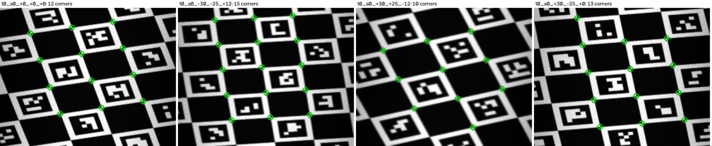

# Head calibration (headcal)

The URDF puts the scanner head's parts where the CAD model draws them. The printed head won't match that exactly: a part seated half a millimetre off, a mirror shaft a degree out of square, a horn screwed on a little turned. At the 15 cm scan distance one degree of error moves the scan line 2.6 mm, about nine scan lines, and the splat trainer needs every line placed to a fraction of one. `headcal` measures where the parts really are, from one calibration scan of a printed tag board, and writes the result back into the URDF and the trainer's head model.

<p align="center">
  
  <br><sub>Four sweeps of the tag board as the line camera builds them up, line by line, in a synthetic calibration scan, with the corners the solver matched circled.</sub>
</p>

It measures:

| What | URDF joint | Why it matters |
|---|---|---|
| The head on the wrist servo horn | `scan_head_mount` | Every pose the arm reports goes through it. |
| The mirror shaft's position and direction, and its home angle | `scan_mirror_joint` | Where the view points at each mirror step. The home angle is where the hall sensor really puts the mirror's zero. |
| The objective (the slit's line of sight) | `spectrograph_optical_joint`, and the folded `line_camera_optical_joint` that follows from it | Where each pixel of the slit looks. |
| The scan line's length | the `scan_line_frame` box | The line camera's focal length. |
| The pose camera, and its lens | `pose_camera_joint`, `pose_camera.yaml` | For tag-board poses later, and as the bridge to the line camera here. |

It doesn't touch the arm's own joint zeros (`sts_calibrate` sets those) or the spectrograph's wavelengths (that's [`hsical`](../README.md)).

## Contents

- [What you need](#what-you-need)
- [First light, step by step](#first-light-step-by-step)
- [Reading the report](#reading-the-report)
- [Using the result](#using-the-result)
- [How it works](#how-it-works)
- [Testing without the hardware](#testing-without-the-hardware)
- [Limits](#limits)
- [Code map](#code-map)

## What you need

- The rig working end to end: the arm calibrated with `sts_calibrate`, the mirror homing, and `line_camera` binning lines with an `hsical` calibration ([`ros2/README.md`](../../ros2/README.md#scanning-with-the-spectrograph-camera)).
- The pose camera (the Pi Camera Module v2 NoIR on the head) on the Nano's second camera port, `/dev/video1`.
- A **laser printer**. Toner is carbon black and stays black in the near infrared; most inkjet inks go transparent past about 700 nm, and the board would fade out of half the bands.
- Stiff, flat card or foam board to glue the print to, and calipers or a steel rule.
- The halogen lamp, lighting the board evenly.
- On the PC, this folder's requirements: `pip install -r requirements.txt` (they include OpenCV and xacro).

## First light, step by step

**1. Print the board.** On the PC, from `calibration/`:

```bash
python -m headcal board ~/headcal
```

This writes `board.svg`: a ChArUco board (a chequerboard with a small square tag in every white square, 24 x 17 squares of 10 mm) on letter paper, with a 100 mm check bar. Print it at 100% ("actual size", not "fit to page") and measure the bar; if it isn't 100.0 mm, the printer scaled it. Glue the print flat onto the card. Then measure 20 squares along the long side as closely as you can and tell `headcal` what you got, for example:

```bash
python -m headcal board ~/headcal --span-mm 199.6
```

That rewrites `board.json` to the printed size (it leaves `board.svg` alone). The board's size sets the scale of everything the calibration measures, so a 0.5% printer error would otherwise become a 0.5% error in every distance.

**2. Place the board.** Lay it flat on the table with its centre 260 mm in front of the arm's base, on base_link's x axis (the centre ticks on its edges help; Foxglove's TF view shows the axis). A centimetre or two off and turned up to about 20° is fine: the calibration measures where the board is. For another spot, make a new plan: `python -m headcal plan --centre 0.24 0.03 --out myplan.yaml`.

**3. Bring up the rig.** In the ROS container (`ros2/docker/run.sh`), start the arm, the mirror and the spectrograph camera as for any scan, with the head at its CAD numbers:

```bash
ros2 launch so101_scan_bringup scan_arm.launch.py camera:=v4l2 camera_calibration:=/data/hsical/cal head_calibration:=none
```

Home the mirror (`ros2 service call /scan_mirror/home std_srvs/srv/Trigger`), then in a second container shell move the arm to the plan's first viewpoint, straight above the board:

```bash
ros2 run so101_scan_sweep move_arm --plan src/linescan-hyperspectral-splatting/calibration/headcal/plans/headcal.yaml
```

Light the board evenly with the halogen lamp and set the line camera's exposure so the board's white paper reads 50 to 90% of full scale, as for a white reference.

**4. Focus the pose camera.** The Camera Module v2's lens is set for far away. On the Nano host (not in the container), from `calibration/`:

```bash
python3 -m headcal record /tmp/focus --device /dev/video1 --focus
```

It prints a sharpness number every second or so. Turn the lens with the focus tool until the number peaks, then Ctrl+C.

**5. Start the recorder**, also on the host, from `calibration/`:

```bash
python3 -m headcal record ~/so101_scan/pose/headcal_1 --device /dev/video1 --auto 0.7
```

`--auto 0.7` first sets the exposure so the brightest part of the view reads about 70% of full scale. Then it grabs a frame every second and keeps one as soon as the view stops changing, and another every 3 seconds while it holds, so each viewpoint gets a few stills taken while the arm holds still for its sweep. Leave it running.

**6. Run the calibration scan**, in the second container shell. With `--dry-run` first, it plays the plan in Foxglove without moving anything and reports any viewpoint that comes too close to the table or a sweep the mirror can't make; then the same without `--dry-run` scans:

```bash
ros2 run so101_scan_sweep scan_sweep --plan src/linescan-hyperspectral-splatting/calibration/headcal/plans/headcal.yaml --dry-run
ros2 run so101_scan_sweep scan_sweep --plan src/linescan-hyperspectral-splatting/calibration/headcal/plans/headcal.yaml
```

The plan visits 22 viewpoints, from straight down to 35° tilted and from several sides, with the board up to 12 mm nearer and farther than the scan line's focus, and sweeps 213 lines at each (one microstep a line). When the scan finishes, stop the recorder with Ctrl+C; it says how many stills it kept (two to four per viewpoint; the solver uses those taken during a sweep and leaves out the rest).

**7. Solve on the PC.** Copy the scan folder and the stills over, then from `calibration/`:

```bash
scp -r nano:so101_scan/scans/headcal_<time> nano:so101_scan/pose/headcal_1 .
python -m headcal solve headcal_<time> headcal_1 --board ~/headcal/board.json -o headcal_out
```

It takes under a minute and writes `headcal_out/report.md`, which is the next thing to read.

**8. Install it.** Copy `headcal_out/head_calibration.yaml` to the Nano as `~/so101_scan/head_calibration.yaml`. From then on `scan_arm.launch.py` builds the URDF with it (its log says `scanner head: calibrated, from ...`), so TF, Foxglove, `lines.csv` and every new scan use the measured head. `head_calibration:=none` goes back to the CAD numbers for one launch.

## Reading the report

**Fit.** Three numbers say whether the solve held together:

- *Pose camera*: corners found in its stills and how far they sit from where the fitted lens puts them. Under 0.3 px rms is good.
- *Line camera*: board corners matched in the sweeps, and how far they sit from where the fitted head puts them, along the slit (pixels) and across it (lines). Under 0.3 is good. Fewer than about 8 corners per sweep usually means the board is too dim, out of focus, or not under the scan line.
- *Arm*: from each viewpoint, how far the board lands from where the other viewpoints put it. This is the arm's own repeatability and joint calibration, not the head's: half a millimetre is about what the STS3215's 0.09° steps give.

**Check these** lists anything that needs a look: a viewpoint that doesn't fit the others (the arm slipped, or a servo misread), the pose camera mounted another way round than the CAD has it, or the slit's pixel order reversed (the solver uses the order that fits and tells you to set `slit_reversed` in `line_camera`'s settings).

**What changed** gives each part's shift and turn from the CAD. A millimetre or two and a degree or three are normal for a printed head; ten millimetres or degrees mean a part is loose or seated wrong. The **mirror home angle** is the angle between where the firmware's homing parks the mirror and where its zero really is. The URDF carries it, so leave the firmware's `home_pos` alone.

**Per viewpoint** has every viewpoint's corner counts and residuals, to find the one that spoils a fit. `line_corners.png` shows the matched corners on the first sweeps.

## Using the result

- `head_calibration.yaml`: the xacro argument `head_calibration` (the launch file passes `~/so101_scan/head_calibration.yaml` when it exists).
- `robot.urdf`: the scan's URDF with the measured head, for anything that reads a URDF file. Scans taken before the calibration convert with it: `python3 splat/tools/scan_to_dataset.py <scan> <dataset> --urdf headcal_out/robot.urdf` works out each line's pose again from the joint readings in `lines.csv`, and takes the trainer's head model and focal length from the calibrated URDF.
- `pose_camera.yaml`: the pose camera's lens as a ROS `camera_info` file (at the stills' 1632 x 1232).
- `calibration.json`: everything above with uncertainties, the trainer's head model, and the board's pose on the table.

Calibrate again after taking the head off the wrist, re-running `sts_calibrate`, changing the mirror's `home_pos`, or knocking a camera. It's one scan.

## How it works

**Two cameras on one head.** The pose camera is an ordinary camera. The line camera is a pushbroom camera: the objective and slit see one line of the scene, the mirror sweeps that line across the board, and stacking the lines builds up a picture whose rows are mirror steps (the sweeps above). Optically, the line camera is the objective seen in the mirror, a virtual camera that turns twice as fast as the mirror; the URDF already models it that way.

**Step 0: the pose camera.** The board's tags give every corner an identity, so OpenCV finds hundreds of numbered corners in each still. From 22 views of a flat board of known size, `calibrateCamera` fits the lens (focal length, centre, distortion), and `solvePnP` gives the board's pose in the camera for each view.

**Hand-eye.** The board doesn't move, but the arm does. For any two viewpoints, how the wrist moved (from the joint readings) and how the board seemed to move in the camera must be the same motion seen from two places, which is the classic hand-eye equation AX = XB. Its rotation part is a fitting problem over the turn axes of all pairs of viewpoints (Park and Martin's method); the translation follows by least squares. That gives the pose camera on the wrist, and the board on the table.

**Step 1: the line camera.** With the board's pose known from the pose camera, the solver renders the sweep each viewpoint should have produced, from the current guess of the head, and matches it against the real sweep: first as a whole (all sweeps together, so the board's repeating squares can't make one sweep lock a square off), then corner by corner. Each matched corner says that at a known mirror step, a known pixel of the slit looked at a known point of the board. One least-squares fit then adjusts everything at once: the pose camera's lens, the objective's position and direction, the mirror shaft's position, direction and home angle, the scan line's length and a little distortion along the slit, and each viewpoint's board pose, which both cameras must agree on. Corners that don't fit are dropped and the rest matched again, three times. This step uses only the two cameras, so the arm's errors can't leak into where the line camera sits relative to the pose camera.

**Step 2: back on the wrist.** The head found in step 1 is then put on the wrist with the hand-eye equation again, this time using every board pose from the joint fit. `--joint-offsets shoulder_lift,elbow_flex,wrist_flex` also fits constant offsets of those joints, as a check of `sts_calibrate`'s zeros.

**What can't be told apart.** Some changes look the same in the data: turning the objective about the slit's line looks like moving the mirror's home angle, and sliding the slit's centre looks like turning the objective. The fit holds one of each pair at the CAD's number and lets the other take up the difference, which gives the same pixel-to-ray mapping, the only thing a scan depends on. The parts' frames are then lined up with the CAD's as closely as the measurements allow, so "what changed" reads as real shifts and turns.

## Testing without the hardware

`python -m headcal selftest` renders a whole calibration scan of a head that is off its CAD numbers by about what a printed head is (up to a millimetre and a couple of degrees per part, the mirror's home off by a degree or two), with a real lens's distortion on the pose camera, 0.03° of noise on every joint reading, and noise, vignetting, lamp fall-off and defocus in both cameras. It calibrates that scan and compares the result with the head it was rendered from. The line camera's accuracy is measured where it counts: pixels' rays against the true ones on the board, at three mirror angles and three points along the slit from every viewpoint.

| Error against the truth | Self-test | Limit |
|---|---|---|
| Line camera rays on the board, median | 0.17 mm | 0.40 mm |
| Line camera rays on the board, worst | 0.26 mm | 0.80 mm |
| Pose camera on the wrist | 0.13 mm, 0.03° | 0.50 mm, 0.15° |
| Pose camera focal length | 0.04 px | 0.5 px |
| Scan line length | 0.05% | 0.3% |

A scan line is about 0.3 mm on the board, so the calibration places it to about half a line. Harder synthetic cases, each a different random head:

| Case | Rays, median / worst |
|---|---|
| The head 2.5 times further off the CAD | 0.27 / 0.60 mm |
| The pose camera mounted upside down | 0.11 / 0.18 mm (and a warning) |
| Only 10 of the 22 viewpoints | 0.40 / 0.55 mm |
| `slit_reversed` wrong in `line_camera`'s settings | 0.15 / 0.23 mm (found, and a warning) |
| Arm joint zeros 1°, 0.8° and 0.6° off | 0.21 / 0.33 mm; with `--joint-offsets`, 0.14 / 0.23 mm and the offsets found within 0.06° |
| No noise on the joint readings | 0.001 / 0.003 mm |

The last row shows where the error comes from: almost all of it is the arm's joint readings, which put the head on the wrist. `pytest` (in `calibration/`) runs the pieces one at a time and an 8-viewpoint scan end to end, including the check that `head_calibration.yaml` builds through xacro into exactly the URDF the solver describes.

## Limits

- **The arm sets the floor.** The STS3215 reads 4096 steps a turn (0.09°), and gears have backlash, so a real arm will likely land the head 0.3 to 0.5 mm less exactly than the synthetic one. The report's arm column measures it. More viewpoints average it down.
- **The mirror is modelled as turning about an axis in its own plane.** A shaft that wobbles, or a mirror glued at a slant to its shaft, can't be represented in the URDF's mimic joint; the fit would spread that error over the other parts.
- **The trainer's line camera is a pinhole.** The slit distortion the solver measures (a pixel or two at the slit's ends) is in the report and `calibration.json`, but nothing downstream uses it yet.
- **The board has to be flat.** A print that lifts 0.5 mm off its card is a 0.5 mm error in that corner. Glue it all over.
- **The face offset** (the mirror's surface in front of its shaft) stays at the CAD's 7.1 mm: changing it looks almost exactly like moving the shaft, which the fit does measure.

## Code map

```
calibration/headcal/
├── __main__.py     command line: python -m headcal <command> --help
├── board.py        the ChArUco board: its corners, the printable SVG, the texture for rendering
├── plan.py         the calibration scan's viewpoints (plans/headcal.yaml), found by IK on the URDF
├── record.py       the pose-camera recorder and focusing aid (Jetson, Python 3.6 and numpy)
├── posecam.py      stills, corner detection, the pose camera's lens and board poses
├── linecam.py      sweeps, rendering a predicted sweep, matching corners
├── model.py        the head's geometry: the line camera through the mirror, URDF origins, the YAML
├── solve.py        hand-eye, the two-camera fit, the gauge, the whole solve
├── output.py       head_calibration.yaml, robot.urdf, calibration.json, the report
├── synth.py        synthetic calibration scans with a known head
├── selftest.py     synth, solve, compare
├── geometry.py     rotations and rigid transforms
└── repo.py         this repo's ROS 2 packages, imported (the URDF's xacro and kinematics)
```
