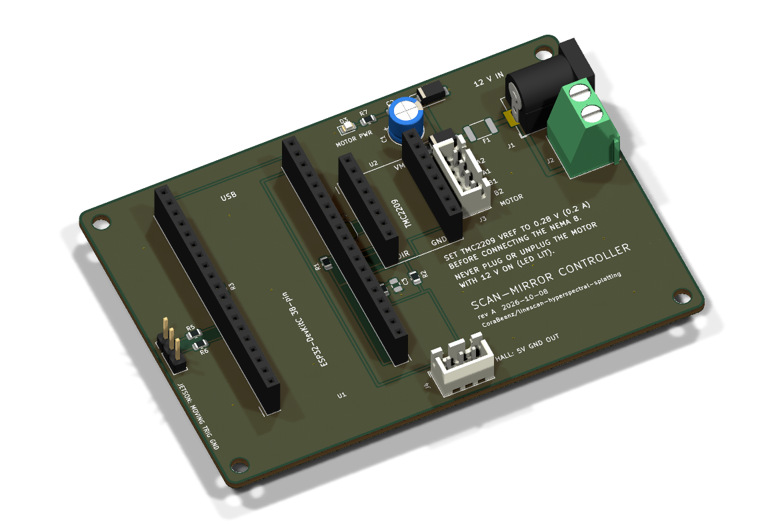
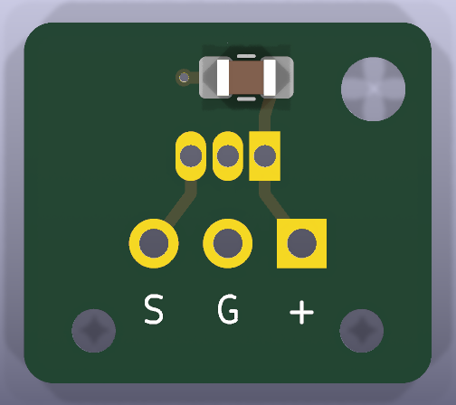

# PCBs

Two boards, drawn in KiCad 10. Everything else on the rig is a ready-made module, a ribbon or a USB cable.

| Board | What it does | Size | Order with |
|---|---|---|---|
| [Scan-mirror controller](#scan-mirror-controller) | Carries the ESP32-DevKitC and the BTT TMC2209 in sockets, takes 12 V for the mirror's NEMA 8, and has the motor, hall-sensor and Jetson connectors | 95 × 66 mm, 2 layers, 1.6 mm | [`scan_controller/fab/`](scan_controller/fab/) |
| [Hall-sensor breakout](#hall-sensor-breakout) | Holds the A3144 home sensor's leads on the outside of the scanner head and takes its 3-wire cable | 14 × 12.4 mm, 2 layers, 0.8 mm | [`hall_breakout/fab/`](hall_breakout/fab/) |

<p align="center">
  
  
</p>

Both boards pass KiCad's electrical rules check (ERC) and design rules check (DRC) with no errors or warnings, including the check that each board matches its schematic. CI runs both on every pull request that touches `pcb/` ([`pcb.yml`](../.github/workflows/pcb.yml)).

## Before you order

1. **Which ESP32 board you have.** The controller's socket is for the **38-pin ESP32-DevKitC**: two rows of 19 pins, **25.4 mm (1.0 in) apart**, with 3V3 and GND at the antenna end. Measure your board's rows. If it's the 30-pin DOIT DevKit, or a 38-pin board with rows 22.9 mm apart, the socket has to change before you order.
2. **The driver's pinout.** Look at your TMC2209 from the potentiometer side, potentiometer at the top. The left header should read EN, MS1, MS2, PDN, PDN, CLK, STEP, DIR from the top and the right one VM, GND, A2, A1, B1, B2, VDD, GND, as on BTT's V1.2 and V1.3 modules. The board's silkscreen marks EN and VM.
3. **Which PDN pin carries the UART.** BTT ships the TMC2209 with the UART on its 4th pin, and solder jumper JP1 comes bridged for that (pads 1-2). If your module was rebuilt for the 5th pin, cut the thin bridge between JP1's pads 1 and 2 and solder 2 to 3.
4. **The barrel jack's pins.** The footprint is KiCad's generic 5.5 × 2.1 mm jack (the common DC-005 style): centre pin at the back, sleeve pin 6 mm in front of it, switch pin 4.7 mm to the side. Check your jack against that, or buy a DC-005.
5. **The 100 µF capacitor** you already have needs to be a radial can, 6.3 mm across, with leads 2.5 mm apart.
6. **At JLCPCB, check the placement preview** for the three parts with a direction: D1 and D2 (cathode stripe toward the left, toward the TMC2209) and D3 (the LED's cathode mark on the left).

## Scan-mirror controller

[Schematic (PDF)](scan_controller/fab/scan_controller.pdf) · [KiCad project](scan_controller/scan_controller.kicad_pro)

It sits beside the SO-101's base. Its wiring is the firmware's pin map ([`board_pins.h`](../firmware/include/board_pins.h)) made permanent: the [firmware README](../firmware/README.md#wiring) describes the same circuit on a breadboard.

- **ESP32-DevKitC (U1)** in two 1×19 female headers, USB toward the board's top edge. It's powered and commanded over its USB cable to the Jetson, so the board has **no 5 V regulator**. A regulator here would also feed back into the Jetson's USB port whenever both were on. A side effect is a safety feature: with USB unplugged the TMC2209 has no logic supply, so the motor can't move even with 12 V on.
- **BTT TMC2209 (U2)** in two 1×8 female headers, wired for UART mode. STEP, DIR and EN go to GPIO 26, 25 and 27. R1 (10 k) pulls EN to 3.3 V, so the motor stays off while the ESP32 boots. The single-wire UART goes to PDN: RX (GPIO 16) straight to it, TX (GPIO 17) through R3 (1 k), because the ESP32 and the driver take turns driving that one wire. MS1 and MS2 go to GND (UART address 0) and CLK to GND (the driver's own clock). VDD is the DevKit's 3.3 V.
- **12 V in** on J1 (the ALITOVE's 5.5 × 2.1 mm plug) or J2 (screw terminal, for a bench supply). F1, a 0.5 A resettable fuse, limits what the 3 A supply can push into a fault. D1 (SS34 Schottky) blocks a reversed supply. D2 (SMAJ15A TVS) clamps spikes when the supply is plugged in or the motor stops, keeping them under the TMC2209's 29 V limit. C1 (100 µF) and C2 (100 nF) sit next to the driver's VM pin. D3 lights while the motor has power.
- **Hall sensor** on J4: 5 V from the DevKit's 5V pin, GND, and the sensor's output. The A3144 needs at least 4.5 V. Its open-collector output can only pull low, so R2 pulls it up to 3.3 V and the ESP32 never sees 5 V. R4 (1 k) limits the current into GPIO 33 if the cable is ever wired wrong. C3 (1 nF) is left off; fit it if motor noise shows up on the hall line.
- **Jetson** on J5: MOVING (GPIO 18) and TRIG (GPIO 19), each through 220 Ω, and GND. Both sides are 3.3 V, so no level shifting. No code reads these pins yet; scan timing comes over the serial link.

### Connectors

| | Type | Pins | Goes to |
|---|---|---|---|
| J1 | 5.5 × 2.1 mm DC jack | centre +12 V | ALITOVE 12 V 3 A supply |
| J2 | 2-pin screw terminal, 5.08 mm | `+` 12 V, `-` GND | a bench supply instead of J1 |
| J3 | JST XH, 4-pin | 1 A2, 2 A1, 3 B1, 4 B2 | NEMA 8: one coil on pins 1-2, the other on 3-4 |
| J4 | JST XH, 3-pin | 1 +5 V, 2 GND, 3 OUT | hall breakout's cable (same pin order there) |
| J5 | 1×3 pin header, 2.54 mm | 1 MOVING, 2 TRIG, 3 GND | free GPIO inputs on the Jetson's 40-pin header, or a scope |
| U1 | DevKit's micro-USB | | Jetson (power and serial) |

Find the motor's coil pairs with a multimeter, not by wire colour: about 24 Ω within a coil, open between coils. A coil connected the wrong way round only reverses the direction, which `CFG dir_inv=1` undoes.

### Before the first power-up

1. **Turn the current down.** BTT's modules leave the factory at VREF ≈ 1.2 V, about 0.85 A, four times what the NEMA 8 takes. With the driver in its socket, **the motor unplugged** and 12 V on, measure between the potentiometer and GND (J5 pin 3 or J2 `-`) and turn it to **VREF ≈ 0.28 V (0.2 A)**. The firmware sets the current over UART, but VREF is what the driver uses before that.
2. **Never plug or unplug the motor while D3 is lit.** The spike can kill the driver.
3. Check the EN pull-up: hold the DevKit's EN button and the driver's EN pin (U2 pin 1) should read 3.3 V.

The firmware README covers the [same steps](../firmware/README.md#before-the-first-power-up). For the [bench test without the motor](../firmware/README.md#bench-test-without-the-motor), leave the TMC2209 out: its empty socket takes male jumper wires for the logic analyser (EN on U2 pin 1, STEP on 7, DIR on 8), and MOVING, TRIG and GND are on J5.

### Outline for the base tray

Coordinates in mm from the board's top-left corner, x to the right and y down, with the USB edge at the top and 12 V at the right:

- **Outline:** 95.0 × 66.0 mm, corners rounded to 2 mm, 1.6 mm thick.
- **Mounting holes:** four M3 (3.2 mm) at (3.5, 3.5), (91.5, 3.5), (3.5, 62.5) and (91.5, 62.5). Through-hole leads stick out up to 3 mm underneath, so stand the board off at least 4 mm.
- **Openings:**
  - Micro-USB: top edge, centred at x 26.7, about 14 mm above the board.
  - 12 V jack: right edge, centred at y 14.0, about 6 mm above the board.
  - Screw terminal's wire entries: right edge at y 22.9 and 28.0.
  - J5: left edge, pins at x 2.5, y 33.0 to 38.1.
  - J3 and J4 are vertical, so their cables leave upward: J3 at x 66.0, y 20.3 to 27.8; J4 at y 61.0, x 45.7 to 50.7.
- **Heights:** the TMC2209 and its heatsink reach about 22 mm above the board, the DevKit about 16 mm, everything else 11 mm or less. Leave air over the driver.

## Hall-sensor breakout

[Schematic (PDF)](hall_breakout/fab/hall_breakout.pdf) · [KiCad project](hall_breakout/hall_breakout.kicad_pro)

The A3144 sits in its pocket in the head's +X wall ([`cad/`](../cad/README.md)), printed face toward the magnet. Its leads bend 90° at the body, run out through the wall's slot, and pass through this board from the back. The board lies flat on the outside of the wall and is held by the soldered leads and a dot of CA glue, or by an M2 screw. C1 (100 nF) bypasses the sensor's supply right at its leads, which matters here because the cable runs up the arm next to the motor's. The pull-up is on the controller.

Seen from outside the head, the leads run **OUT, GND, VCC from left to right**, mirrored from the datasheet's front view, because you're looking at the sensor's back. The square pad is VCC. The cable solders into the three pads marked S, G and + (OUT, GND, +5 V), in the controller's J4 order, and the two 1.5 mm holes below them take thread or a thin cable tie as strain relief. Solder the cable straight in rather than fitting a pin header, which would stand about 9 mm off the head.

**Where it goes**, in the head's frame (mm): the +X outer face is at x = 16.0. The leads come out at z = 22.4, at y = −11.54 (OUT), −10.27 (GND) and −9.00 (VCC). The board spans y −17.27 to −3.27 and z 14.6 to 27.0, clear of the lid-bolt counterbores below it. Its M2 hole is at y −5.27, z 24.7, and the tie holes at y −14.87 and −5.67, z 16.4. It stands about 2 mm proud of the wall, or 3 mm with the cable.

### Changes the CAD needs

- **A base tray for the controller** beside the SO-101's base, from the outline above. Nothing in [`cad/`](../cad/) holds it yet.
- **The hall breakout on the +X face** as a part, with the wrist-roll and wrist-flex clearance checks rerun, since it adds about 3 mm there. To screw it on rather than glue it, add an M2 pilot hole at y −5.27, z 24.7.
- **Cable clips along the arm** for the 4-wire motor cable and the 3-wire hall cable. Keep them apart, and give the hall cable strain relief at the head.

## Parts

Parts you already have go in sockets or are soldered by hand. JLCPCB's SMT assembly fits the small parts, all on the top side. Every part number below was checked on [LCSC](https://www.lcsc.com/) in October 2026.

| Ref | Part | Who fits it |
|---|---|---|
| U1 | ESP32-DevKitC (yours), in 2 × 1×19 female headers, 2.54 mm | you |
| U2 | BTT TMC2209 V1.3 (yours), in 2 × 1×8 female headers, 2.54 mm | you |
| C1 | 100 µF 25 V electrolytic (yours; 35 V is better), 6.3 mm, 2.5 mm pitch | you |
| J1 | 5.5 × 2.1 mm DC jack, DC-005 style | you |
| J2 | 2-pin screw terminal, 5.08 mm (KF301-5.08 or Phoenix MKDS 1,5/2-5,08) | you |
| J3 | JST B4B-XH-A, LCSC C144395, plus a 4-pin XH pigtail for the motor | you |
| J4 | JST B3B-XH-A, LCSC C144394, plus a 3-pin XH pigtail for the hall cable | you |
| J5 | 1×3 pin header, 2.54 mm | you |
| F1 | 0.5 A hold, 30 V PTC fuse, 1812: PTTC SMD1812P050TF/30, C492015 | JLCPCB |
| D1 | SS34 Schottky, SMA: C8678 | JLCPCB |
| D2 | SMAJ15A TVS, SMA: C113958 | JLCPCB |
| D3 | green LED, 0805: KT-0805G, C2297 | JLCPCB |
| C2 | 100 nF 50 V X7R, 0805: C49678 | JLCPCB |
| C3 | 1 nF 0805, C46653: not fitted | |
| R1, R2 | 10 k 0805: C17414 | JLCPCB |
| R3, R4 | 1 k 0805: C17513 | JLCPCB |
| R5, R6 | 220 Ω 0805: C17557 | JLCPCB |
| R7 | 4.7 k 0805: C17673 | JLCPCB |
| hall U1 | A3144 (yours) | you |
| hall C1 | 100 nF 0805, C49678 (large pads, easy to hand-solder) | you or JLCPCB |

The ALITOVE supply, the NEMA 8 and the magnet need no board parts. Keep your through-hole 10 k and 1 k resistors for breadboard tests; the boards use 0805s. F1 and D2 may be "extended" parts at JLCPCB, which adds a small fee per part type; they're easy to hand-solder instead.

## Ordering at JLCPCB

**Controller:** upload [`scan_controller_gerbers.zip`](scan_controller/fab/scan_controller_gerbers.zip). Use the defaults: 2 layers, FR-4, 1.6 mm, 1 oz copper, HASL (lead-free), any solder mask colour. The board uses 0.25 mm tracks, 0.2 mm clearance and 0.3 mm vias, all standard. For assembly, choose economic PCBA on the top side and upload [`bom_jlc.csv`](scan_controller/fab/bom_jlc.csv) and [`cpl_jlc.csv`](scan_controller/fab/cpl_jlc.csv), which cover only the parts JLCPCB fits. [`bom.csv`](scan_controller/fab/bom.csv) lists everything.

**Hall breakout:** upload [`hall_breakout_gerbers.zip`](hall_breakout/fab/hall_breakout_gerbers.zip) and set the thickness to **0.8 mm**, which keeps it close to the wall. Everything else stays default. With one capacitor on it, assembly is optional ([`bom_jlc.csv`](hall_breakout/fab/bom_jlc.csv), [`cpl_jlc.csv`](hall_breakout/fab/cpl_jlc.csv)). JLCPCB prints an order number on each board unless you pay to remove it; on a board this small it may land on the back, which is fine.

## Files

```
pcb/
├── README.md
├── lib/                   project library: rig.kicad_sym and rig.pretty
├── scan_controller/       KiCad project (.kicad_pro, .kicad_sch, .kicad_pcb)
│   └── fab/               gerbers and drill (zip), BOMs, placement file, schematic PDF, ERC and DRC reports
├── hall_breakout/         same layout
├── img/                   the renders above
└── tools/
    ├── boards.py          each board's parts, nets, placement and track routes
    ├── build_boards.py    writes the library, schematics and layouts from boards.py
    ├── fab.py             ERC, DRC and the fab files
    ├── library.py         the project library, and the parts KiCad doesn't have
    ├── schematic.py       schematic writer
    └── sexpr.py           reads and writes KiCad's file format
```

The library holds copies of the KiCad parts the boards use, plus four drawn here: the ESP32-DevKitC socket, the TMC2209 socket, the A3144's lead holes and the cable pads. So the projects open the same way on any machine, and in CI, whatever KiCad libraries are installed.

## Editing and rebuilding

Open `scan_controller/scan_controller.kicad_pro` or `hall_breakout/hall_breakout.kicad_pro` in KiCad 10 and edit as usual. Then refresh the fab files and renders:

```bash
python pcb/tools/fab.py                 # ERC, DRC, then fab/ and img/ for both boards
python pcb/tools/fab.py --check-only    # ERC and DRC only, as CI runs them
```

The boards were generated by `build_boards.py`, which places and routes every part from `boards.py`. It needs the Python that ships with KiCad, which has the `pcbnew` module, and it **overwrites both projects**: rerun it only to change `boards.py` (for example to switch to a 30-pin DevKit), not after editing a board by hand.

```bash
"%LOCALAPPDATA%\Programs\KiCad\10.0\bin\python.exe" pcb\tools\build_boards.py    # Windows
```
