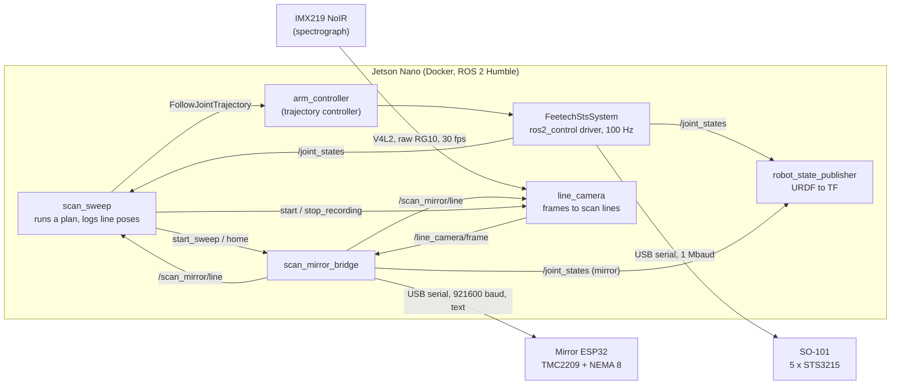

# ROS 2: the SO-101 scan arm

ROS 2 Humble packages that move the SO-101 between viewpoints, sweep the scan mirror at each
one, record the spectrograph camera's view of every scan line, and log where the instrument was
for each, which is what the line-camera splat needs: its lines and their camera poses.

| Package | What's in it |
|---|---|
| [`so101_scan_interfaces`](so101_scan_interfaces) | Messages and services: `ScanLine`, `MirrorState`, `ScanLinePose`, `FrameStamp`, `StartSweep`, `MoveMirror`, `StartRecording`, `CaptureReference` |
| [`so101_scan_hardware`](so101_scan_hardware) | ros2_control driver for the STS3215 servo bus (C++), plus `sts_scan`, `sts_calibrate` and a fake servo bus |
| [`so101_scan_description`](so101_scan_description) | URDF: the SO-101 with the scanner head on its wrist, the scan mirror as a joint, the line camera as the mirror sees it |
| [`so101_scan_bringup`](so101_scan_bringup) | `scan_arm.launch.py` and the controller and mirror settings |
| [`so101_scan_sweep`](so101_scan_sweep) | Mirror bridge, simulated mirror ESP32, `scan_sweep` (and its `--dry-run`), `make_plan` (views around a spot, or covering an object), `move_arm`, example plans |
| [`so101_scan_camera`](so101_scan_camera) | `line_camera` (the IMX219 through V4L2: frames to calibrated scan lines, and colour waterfalls of each sweep), `capture_reference`, `scan_to_dataset` (a scan to the splat trainer's dataset), a simulated camera and spectrograph |
| [`docker/`](docker), [`udev/`](udev) | The container for the Jetson Nano and stable device names |

## How it fits together



For each viewpoint, `scan_sweep` moves the arm, waits for it to stop, and asks the bridge for a
sweep. The ESP32 steps the mirror line by line, holding still on each for about a camera frame,
and stamps each line with its own microsecond clock; the bridge maps that clock onto ROS time
(ping round trips, about 1 ms), so every line carries the ROS time the mirror settled.
`scan_sweep` then reads the arm's joints at that instant from `/joint_states`, adds the line's
mirror angle, and puts both through the URDF to get the head pose and the line-camera pose.

The spectrograph camera runs on its own 30 fps clock, so the bridge locks each sweep to it
([`frame_lock.py`](so101_scan_sweep/so101_scan_sweep/frame_lock.py)): from the `FrameStamp`
`line_camera` publishes for every frame (when the rows that see the slit were exposing), it fits
the frame clock, makes the line period a whole number of frames, and times every mirror move to
fall between two exposures, nudging the ESP32's line clock as the two drift apart. `line_camera`
keeps the frames whose whole exposure fell while the mirror held still on a line, bins each into
slit positions x wavelengths with the calibration kit's maps, and writes them into the scan's
folder while `scan_sweep` has it recording.

A few ROS 2 ideas this leans on:
- **ros2_control** splits a robot into a *hardware interface* (here, the C++ driver that reads
  and writes the servos) and *controllers* that run on top of it in a fixed-rate loop. The same
  controllers run on `mock_components/GenericSystem` when there's no arm.
- **The trajectory controller** takes a goal ("be at these joint angles in 3 s") as an *action*,
  interpolates it at 100 Hz, and reports when it's done.
- **TF** is ROS's tree of coordinate frames; `robot_state_publisher` keeps it current from the
  URDF and `/joint_states`, which is what RViz and Foxglove draw.

## Frames and conventions

All lengths in metres, angles in radians, quaternions x y z w.

| Frame | Where |
|---|---|
| `base_link` | SO-101 base; the table top is at z = -0.0024 |
| `scan_head_link` | Head frame from the CAD: origin on the wrist-roll horn face, +Z away from the wrist, +Y out of the scan window, X along the mirror shaft and the slit |
| `scan_mirror_link` | Turns with `scan_mirror_joint` |
| `spectrograph_optical_frame` | The objective as built, looking into the mirror |
| `line_camera_optical_frame` | The objective as seen in the mirror: a pinhole for one scan line. z is the view, x runs along the slit in pixel order. It turns twice as fast as the mirror (a mimic joint) |
| `scan_line_frame` | Middle of the in-focus scan line, 0.15 m along the view |
| `pose_camera_optical_frame` | The Pi NoIR pose camera |

The head's frames come from the CAD model until a head calibration exists: with `~/so101_scan/head_calibration.yaml` (from [`calibration/headcal`](../calibration/headcal/README.md)), `scan_arm.launch.py` builds the URDF with the measured mount, mirror, objective and pose camera instead.

**Mirror angle:** 0 is the 45° rest, where the head looks straight out of its window (+Y);
positive turns the view toward +Z. The hall sensor sits at -40°, which the firmware keeps as
`home_pos` (-711 microsteps); homing finds it and parks the mirror at 0. One microstep is
2π/6400 rad (0.05625°) of mirror and twice that of view.

**Arm joints:** zero is the URDF's zero pose (upper arm straight up, forearm level and
forward, wrist in line, scan window facing right). `sts_calibrate` records each servo's ticks
in that pose, which way it turns, and its range.

## Try it without hardware

On any 64-bit Linux machine with Docker (or the Nano itself):

```bash
ros2/docker/run.sh                 # builds the image the first time, then opens a shell
colcon build && source install/setup.bash
ros2 launch so101_scan_bringup scan_arm.launch.py use_mock_hardware:=true mirror:=fake camera:=fake foxglove:=true
```

In a second shell (`ros2/docker/run.sh` again):

```bash
ros2 run so101_scan_sweep scan_sweep --plan src/linescan-hyperspectral-splatting/ros2/so101_scan_sweep/plans/ring.yaml
```

The arm (mock) visits four viewpoints, the simulated mirror sweeps 107 lines at each, the
simulated camera records them, and a folder appears under `~/so101_scan/scans/` on the host.
`ros2 run so101_scan_camera scan_to_dataset /data/scans/<that folder> /data/datasets/ring` turns
it into a dataset `splat_train` reads. To watch, open
[Foxglove](https://foxglove.dev/download) on Windows, connect to `ws://<that machine's ip>:8765`, add a
3D panel, and turn on `/scan/markers`: every scan line lands on the table in front of the arm.
With ROS 2 on a desktop, `rviz:=true` does the same.

New viewpoints: `make_plan` finds arm poses that put the scan line on a spot from several
directions, and leaves out the ones the arm can't reach or that come too close to the table:

```bash
ros2 run so101_scan_sweep make_plan --target 0.26 0 0.03 --tilts 0 20 --azimuths 90 180 270 --out /data/plans/box.yaml
```

## Seeing a scan before and while it runs

**Plan around an object.** Give `make_plan` the object as a box (the middle of its bottom, then
its width, depth and height along `base_link` x, y and z, in metres) and it plans for coverage
([`coverage.py`](so101_scan_sweep/so101_scan_sweep/coverage.py)):

```bash
ros2 run so101_scan_sweep make_plan --object 0.26 0 --size 0.06 0.06 0.012 --out /data/plans/relief.yaml
```

It tries views from several tilts and azimuths aimed where they meet the box, works out which
points on its top and sides each view's sweep sees (inside the scan line's fan, within 30 mm of
focus, and facing the camera within 60°), and keeps the fewest views that see every point from
two directions, since a splat needs two to place a point in depth. It prints how much of each
face the plan covers; a face no reachable view sees (the side facing the arm's base, usually)
is named, so you can turn the object round for a second scan.

**Dry run.** `scan_sweep --plan <plan> --dry-run` plays a plan on the running stack without
moving anything ([`dry_run.py`](so101_scan_sweep/so101_scan_sweep/dry_run.py)): a see-through
copy of the arm moves through the viewpoints at the plan's speed in RViz or Foxglove
(`/scan/markers`), each sweep's scan lines appear where they would land, and a coverage plan's
box shows its surface turning from red to yellow to green as views see it. It checks every move
for the joint limits and for how close the arm and head come to the table (and the object) on
the way, the sweep against the bridge's mirror limits, and whether the controller, the mirror
(homed?) and the camera are up, then prints a report and exits 1 if anything would go wrong.
`--speed 4` plays it four times faster, and `--no-play` only checks. Try every new plan this way
before the real arm runs it.

**Colour waterfalls.** While a sweep runs, `line_camera` publishes it as images, a row per scan
line and the slit across: `/line_camera/scan_preview_true_color` (what your eye would see) and
`/line_camera/scan_preview_cir` (colour infrared: 800 to 900 nm as red, so plants glow red and
green paint doesn't), next to the grey `/line_camera/scan_preview`. They're worked out the way
`scan_to_dataset` makes the dataset, as reflectance against the latest white reference in the
46 bands from 500 to 950 nm, with the same colour maths as the splat renderer and the web viewer
([`waterfall.py`](so101_scan_camera/so101_scan_camera/waterfall.py)). Until a white is taken
the colours are relative to the calibration's lamp, close but not exact. Magenta marks a slit
bin with a saturated pixel: lower `exposure_us`. In Foxglove, add an Image panel on either topic.

## On the Jetson Nano

JetPack 4 is Ubuntu 18.04 and Humble needs 22.04, so ROS runs in the container
([`docker/Dockerfile`](docker/Dockerfile)); the Nano only needs Docker, which JetPack includes.
[`docker/run.sh`](docker/run.sh) explains each flag it passes.

1. **Clone the repo** on the Nano, let your user run Docker, and give the two USB devices
   stable names:
   ```bash
   sudo usermod -aG docker $USER      # then log out and back in, once
   sudo cp ros2/udev/99-so101-scan.rules /etc/udev/rules.d/
   sudo udevadm control --reload-rules && sudo udevadm trigger
   ls -l /dev/so101 /dev/scan_mirror
   ```
   If a name is missing, check the device's id with `lsusb` and fix its line in the rules file
   (the file says how).
2. **Build:** `ros2/docker/run.sh`, then `colcon build` inside (about 10 minutes the first time
   on a Nano; later builds only redo what changed). On JetPack 4.6, use
   [`jetson/ros.sh`](../jetson/README.md) in place of `run.sh`: its Docker can't build this image.

## First steps with the real arm

Each step checks one thing before the next one trusts it. Power the servos from their own
supply; keep a hand near the power switch for anything that moves. Stopping a launch leaves
the motors holding the arm where it is; `torque:=false` or that switch lets it go.

1. **Find the servos** (read-only, nothing moves):
   `ros2 run so101_scan_hardware sts_scan --port /dev/so101`
   should list ids 1 to 5 with their positions and voltages.
2. **Calibrate:** `ros2 run so101_scan_hardware sts_calibrate --port /dev/so101`.
   It switches the motors off (asking you to hold the arm first if they are holding it), then
   asks you to put the arm in the zero pose, move each joint through its range and nudge each
   joint the way it names, and writes `~/so101_scan/calibration.yaml`. The servos' homing
   offsets stay as they are unless you add `--write-homing-offset`, and a run you stop puts them
   back; the only other thing it writes is position mode, to a servo that isn't in it. Already
   calibrated the arm with LeRobot? `--from-lerobot <its json>` converts that file instead;
   check the wrist roll afterwards.
3. **Check the calibration with the motors off:**
   `ros2 launch so101_scan_bringup scan_arm.launch.py torque:=false mirror:=fake foxglove:=true`.
   The motors switch off as it starts, so hold the arm. Move it by hand: the model in Foxglove
   should follow joint for joint. A joint that turns the wrong way needs its sign fixed: stop
   the launch first (the driver and `sts_calibrate` can't share the servo port), then run
   `sts_calibrate --joints <name>`.
4. **First move, slowly:** launch again without `torque:=false`. The motors switch on holding
   the arm where it is; if a joint is well outside its calibrated range, the driver leaves them
   off and names the joint (stop the launch and recalibrate it, or move it into range with
   `torque:=false`). Then
   `ros2 run so101_scan_sweep move_arm --plan <plans>/one_view.yaml` moves at 20°/s to the
   view that looks straight down at the table.
5. **A scan with the simulated mirror:** first `ros2 run so101_scan_sweep scan_sweep --plan <plans>/one_view.yaml --dry-run`
   to see the move in Foxglove and read the report, then the same without `--dry-run`.
   The arm moves and holds while the fake mirror sweeps; check `arm_motion_max_rad` in the
   scan's `scan.json` to see how still the arm held.
6. **The real mirror:** flash and bench-test the ESP32 first
   ([`firmware/README.md`](../firmware/README.md): wiring, the driver's current, first run).
   Then launch with the default `mirror:=esp32` and run
   `ros2 service call /scan_mirror/home std_srvs/srv/Trigger`, which powers the motor and finds
   the hall sensor (needed again whenever the ESP32 restarts), and scan. If sweeps run
   backwards, stop the launch and send the ESP32 `CFG dir_inv=1` then `SAVE` (the firmware
   README shows how).

`<plans>` is `src/linescan-hyperspectral-splatting/ros2/so101_scan_sweep/plans`.

## Scanning with the spectrograph camera

1. **Calibrate** the spectrograph with the kit in [`calibration/`](../calibration/README.md), in
   the sensor mode `line_camera` scans in: `python3 -m hsical plan ~/sessions/first_light
   --width 1640 --height 1232`. The 2x2 binned mode reads the slit's rows in about 20 ms, which
   leaves time for the mirror to move between frames at 30 fps; at full resolution a line would
   take two frames.
2. **Start the camera with the arm:** `ros2 launch so101_scan_bringup scan_arm.launch.py
   camera:=v4l2 camera_calibration:=/data/hsical/cal` (the folder `hsical calibrate` wrote).
   [`config/line_camera.yaml`](so101_scan_camera/config/line_camera.yaml) has its settings;
   `ros2 param set /line_camera exposure_us 8000` changes the exposure while it runs, and
   `~/preview` and `~/scan_preview` show the frames and the sweep so far, the sweep in colour
   too (see [the colour waterfalls](#seeing-a-scan-before-and-while-it-runs)).
3. **Take a white and a dark**, with the mirror still and the head over the PTFE sheet under the
   scan's lamp: `ros2 run so101_scan_camera capture_reference white`, then cap the lens and
   `capture_reference dark`. It says how bright the white is; aim for a peak of 50 to 90% of
   full scale and take the dark at the same exposure. The next scans use them, and so do the
   colour waterfalls.
4. **Scan:** `scan_sweep` has `line_camera` record into the scan's folder, and the bridge locks
   the sweeps to its frames (the log says how many frames a line takes). A plan's
   `camera: {record: required}` refuses to scan without the camera; `off` scans without it.
5. **Convert:** `ros2 run so101_scan_camera scan_to_dataset <scan folder> <dataset folder>`, or
   `python3 splat/tools/scan_to_dataset.py` on any computer with numpy, then `splat_train`.
   Values are reflectance against the white, 46 bands from 500 to 950 nm, 256 pixels along the
   slit, one head pose per sweep; `--help` lists the options.

Two things to check on the first real scan: that pixel 0 is the head's -X end of the slit (scan
something asymmetric; if the dataset comes out mirrored, set `slit_reversed: true`), and that
frames are stamped when the sensor starts reading out (`frames.csv` has every line `ok` and
sharp; if lines blur into their neighbours, `stamp_offset_us` shifts the driver's timestamps).

## What a scan writes

`<output_dir>/<name>_<date>-<time>/` (by default under `$SO101_SCAN_DATA/scans`, which is
`~/so101_scan` on the host):

- **`lines.csv`**, one row per scan line: `viewpoint, sweep_id, index, stamp_ns, hold_until_ns,
  settled, mirror_angle`, the head pose `head_x..head_qw` and the line-camera pose
  `cam_x..cam_qw` in `base_link`, and the five arm joints at the line's time. The mirror holds
  still from `stamp_ns` until `hold_until_ns`, so a camera frame belongs to a line when its
  whole exposure falls in between. `settled` is 0 when the mirror was still moving as the next
  line came due (a longer `line_period_s` fixes that).
- **`scan.json`**: the plan, and per viewpoint whether the move succeeded, lines expected and
  logged, line period and jitter, and how much the arm moved during the sweep.
- **`robot.urdf`** and **`plan.yaml`**: the URDF the poses came from (calibration included)
  and the plan as run, so the poses can be recomputed later.
- With the camera: **`frames/`** (`camera.json`, and `frames.csv` saying which frame each line
  got, when it was exposed, or why it got none), **`binned/`** (each sweep's lines as float32
  `[lines, slit bins, bands]` of mean raw counts, and the binning grid) and **`reference/`**
  (darks and whites). [`session.py`](so101_scan_camera/so101_scan_camera/session.py) describes
  them in full.

## The mirror ESP32's serial protocol

The firmware is in [`firmware/`](../firmware), and its protocol in
[`firmware/PROTOCOL.md`](../firmware/PROTOCOL.md): plain text at 921600 baud, so it can be tried
in any serial monitor. Each command, `VERB key=value ... id=<n>`, gets one `OK` or `ERR` reply
with the same id, and the ESP32 sends `EV` lines when something happens (a scan line, homing
done, a fault, a restart). The bridge uses `INFO`, `PING`, `STATUS`, `ENABLE`, `HOME`, `MOVE`,
`STOP` and stare-mode `SCAN`; its side of the protocol is
[`mirror_protocol.py`](so101_scan_sweep/so101_scan_sweep/mirror_protocol.py), and
`fake_scan_mirror` plays the ESP32 for the tests and for `mirror:=fake`. Locking sweeps to the
camera's frames uses `CFG` (the move and settle times), `NUDGE` (shift the line clock) and
`PERIOD` (change its rate).

## Development

```bash
colcon build && colcon test && colcon test-result --verbose
```

The tests need no hardware: the C++ driver runs against the fake servo bus, the bridge against
the simulated ESP32, one test brings up the whole stack and scans a two-viewpoint plan, another
plans views around a box and plays them with `--dry-run` (checking nothing moved), and the
camera tests run `line_camera` on a simulated camera that sees what the simulated mirror really
did, check its colour waterfalls against the scene's true colours, and replay a synthetic scan
through `scan_to_dataset` to check that the trainer's camera model sees the scene in every
pixel of every line.

The URDF has two generated parts. `so101_arm.xacro` comes from the vendored SO-101 URDF
(`scripts/so101_urdf_to_xacro.py`), and `scan_head_params.xacro` plus the head meshes come from
the FreeCAD model (`scripts/export_head_from_cad.py`, run with
`freecadcmd -c "exec(open('ros2/so101_scan_description/scripts/export_head_from_cad.py').read())"`
from the repo root after rebuilding `cad/`). The description tests fail when `so101_arm.xacro`
is stale or when the head's numbers disagree with `cad/build_report.json`.
