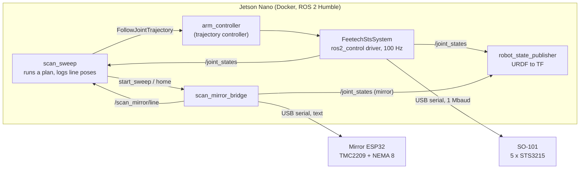

# ROS 2: the SO-101 scan arm

ROS 2 Humble packages that move the SO-101 between viewpoints, sweep the scan mirror at each
one, and log where the instrument was for every scan line, which is what the line-camera splat
needs as camera poses.

| Package | What's in it |
|---|---|
| [`so101_scan_interfaces`](so101_scan_interfaces) | Messages and services: `ScanLine`, `MirrorState`, `ScanLinePose`, `StartSweep`, `MoveMirror` |
| [`so101_scan_hardware`](so101_scan_hardware) | ros2_control driver for the STS3215 servo bus (C++), plus `sts_scan`, `sts_calibrate` and a fake servo bus |
| [`so101_scan_description`](so101_scan_description) | URDF: the SO-101 with the scanner head on its wrist, the scan mirror as a joint, the line camera as the mirror sees it |
| [`so101_scan_bringup`](so101_scan_bringup) | `scan_arm.launch.py` and the controller and mirror settings |
| [`so101_scan_sweep`](so101_scan_sweep) | Mirror bridge, simulated mirror ESP32, `scan_sweep`, `make_plan`, `move_arm`, example plans |
| [`docker/`](docker), [`udev/`](udev) | The container for the Jetson Nano and stable device names |

## How it fits together



For each viewpoint, `scan_sweep` moves the arm, waits for it to stop, and asks the bridge for a
sweep. The ESP32 steps the mirror line by line and stamps each line with its own microsecond
clock; the bridge maps that clock onto ROS time (ping round trips, about 1 ms), so every line
carries the ROS time the mirror settled. `scan_sweep` then reads the arm's joints at that
instant from `/joint_states`, adds the line's mirror angle, and puts both through the URDF to
get the head pose and the line-camera pose.

A few ROS 2 ideas this leans on:
- **ros2_control** splits a robot into a *hardware interface* (here, the C++ driver that reads
  and writes the servos) and *controllers* that run on top of it in a fixed-rate loop. The same
  controllers run on `mock_components/GenericSystem` when there's no arm.
- **The trajectory controller** takes a goal ("be at these joint angles in 3 s") as an *action*,
  interpolates it at 100 Hz, and reports when it's done.
- **TF** is ROS's tree of coordinate frames; `robot_state_publisher` keeps it current from the
  URDF and `/joint_states`, which is what RViz and Foxglove draw.

## Frames and conventions

All lengths in metres, angles in radians, quaternions x y z w.

| Frame | Where |
|---|---|
| `base_link` | SO-101 base; the table top is at z = -0.0024 |
| `scan_head_link` | Head frame from the CAD: origin on the wrist-roll horn face, +Z away from the wrist, +Y out of the scan window, X along the mirror shaft and the slit |
| `scan_mirror_link` | Turns with `scan_mirror_joint` |
| `spectrograph_optical_frame` | The objective as built, looking into the mirror |
| `line_camera_optical_frame` | The objective as seen in the mirror: a pinhole for one scan line. z is the view, x runs along the slit in pixel order. It turns twice as fast as the mirror (a mimic joint) |
| `scan_line_frame` | Middle of the in-focus scan line, 0.15 m along the view |
| `pose_camera_optical_frame` | The Pi NoIR that sees the AprilTags (nominal, until hand-eye calibration) |

**Mirror angle:** 0 is the 45° rest, where the head looks straight out of its window (+Y);
positive turns the view toward +Z. The hall sensor triggers at -40° (`home_angle` in
[`scan_mirror.yaml`](so101_scan_bringup/config/scan_mirror.yaml)). One microstep is
2π/6400 rad (0.05625°) of mirror and twice that of view.

**Arm joints:** zero is the URDF's zero pose (upper arm straight up, forearm level and
forward, wrist in line, scan window facing right). `sts_calibrate` records each servo's ticks
in that pose, which way it turns, and its range.

## Try it without hardware

On any 64-bit Linux machine with Docker (or the Nano itself):

```bash
ros2/docker/run.sh                 # builds the image the first time, then opens a shell
colcon build && source install/setup.bash
ros2 launch so101_scan_bringup scan_arm.launch.py use_mock_hardware:=true mirror:=fake foxglove:=true
```

In a second shell (`ros2/docker/run.sh` again):

```bash
ros2 run so101_scan_sweep scan_sweep --plan src/linescan-hyperspectral-splatting/ros2/so101_scan_sweep/plans/ring.yaml
```

The arm (mock) visits four viewpoints, the simulated mirror sweeps 107 lines at each, and a
folder appears under `~/so101_scan/scans/` on the host. To watch, open
[Foxglove](https://foxglove.dev/download) on Windows, connect to `ws://<that machine's ip>:8765`, add a
3D panel, and turn on `/scan/markers`: every scan line lands on the table in front of the arm.
With ROS 2 on a desktop, `rviz:=true` does the same.

New viewpoints: `make_plan` finds arm poses that put the scan line on a spot from several
directions, and leaves out the ones the arm can't reach or that come too close to the table:

```bash
ros2 run so101_scan_sweep make_plan --target 0.26 0 0.03 --tilts 0 20 --azimuths 90 180 270 --out /data/plans/box.yaml
```

## On the Jetson Nano

JetPack 4 is Ubuntu 18.04 and Humble needs 22.04, so ROS runs in the container
([`docker/Dockerfile`](docker/Dockerfile)); the Nano only needs Docker, which JetPack includes.
[`docker/run.sh`](docker/run.sh) explains each flag it passes.

1. **Clone the repo** on the Nano and give the two USB devices stable names:
   ```bash
   sudo cp ros2/udev/99-so101-scan.rules /etc/udev/rules.d/
   sudo udevadm control --reload-rules && sudo udevadm trigger
   ls -l /dev/so101 /dev/scan_mirror
   ```
   If a name is missing, check the device's id with `lsusb` and fix its line in the rules file
   (the file says how).
2. **Build:** `ros2/docker/run.sh`, then `colcon build` inside (about 10 minutes the first time
   on a Nano; later builds only redo what changed).

## First steps with the real arm

Each step checks one thing before the next one trusts it. Power the servos from their own
supply; keep a hand near the power switch for anything that moves.

1. **Find the servos** (read-only, nothing moves):
   `ros2 run so101_scan_hardware sts_scan --port /dev/so101`
   should list ids 1 to 5 with their positions and voltages.
2. **Calibrate:** `ros2 run so101_scan_hardware sts_calibrate --port /dev/so101`.
   It asks you to hold the arm in the zero pose, move each joint through its range, then nudge
   each joint the way it names, and writes `~/so101_scan/calibration.yaml`. It only reads
   unless you add `--write-homing-offset`. Already calibrated the arm with LeRobot?
   `--from-lerobot <its json>` converts that file instead; check the wrist roll afterwards.
3. **Check the calibration with the motors off:**
   `ros2 launch so101_scan_bringup scan_arm.launch.py torque:=false mirror:=fake foxglove:=true`.
   Move the arm by hand: the model in Foxglove should follow joint for joint. A joint that turns
   the wrong way needs its sign fixed (`sts_calibrate --joints <name>`).
4. **First move, slowly:** launch again without `torque:=false`, then
   `ros2 run so101_scan_sweep move_arm --plan <plans>/one_view.yaml` moves at 20°/s to the
   view that looks straight down at the table.
5. **A scan with the simulated mirror:** `ros2 run so101_scan_sweep scan_sweep --plan <plans>/one_view.yaml`.
   The arm moves and holds while the fake mirror sweeps; check `arm_motion_max_rad` in the
   scan's `scan.json` to see how still the arm held.
6. **The real mirror:** with the ESP32 flashed and plugged in, launch with the default
   `mirror:=esp32`, then `ros2 service call /scan_mirror/home std_srvs/srv/Trigger`, and scan.
   If sweeps run backwards, set `direction: -1` in `scan_mirror.yaml`.

`<plans>` is `src/linescan-hyperspectral-splatting/ros2/so101_scan_sweep/plans`.

## What a scan writes

`<output_dir>/<name>_<date>-<time>/` (by default under `$SO101_SCAN_DATA/scans`, which is
`~/so101_scan` on the host):

- **`lines.csv`**, one row per scan line: `viewpoint, sweep_id, index, stamp_ns, mirror_angle`,
  the head pose `head_x..head_qw` and the line-camera pose `cam_x..cam_qw` in `base_link`, and
  the five arm joints at the line's time. Camera frames are matched to lines by `stamp_ns`.
- **`scan.json`**: the plan, and per viewpoint whether the move succeeded, lines expected and
  logged, line period and jitter, and how much the arm moved during the sweep.
- **`robot.urdf`** and **`plan.yaml`**: the URDF the poses came from (calibration included)
  and the plan as run, so the poses can be recomputed later.

## The mirror ESP32's serial protocol

Plain text, one message per line, so it can be tried in any serial monitor:
`SWEEP <id> <start_step> <steps_per_line> <n_lines> <period_us>` answered by
`OK SWEEP <id>`, then `LINE <id> <index> <step> <t_us>` per line and `DONE <id> <t_us>`;
`PING`/`PONG` for the clock, plus `HOME`, `GOTO`, `STOP` and `STATUS`. The full list is at the
top of [`mirror_protocol.py`](so101_scan_sweep/so101_scan_sweep/mirror_protocol.py); a change to
the wire format is a change to that file only.

## Development

```bash
colcon build && colcon test && colcon test-result --verbose
```

The tests need no hardware: the C++ driver runs against the fake servo bus, the bridge against
the simulated ESP32, and one test brings up the whole stack and scans a two-viewpoint plan.

The URDF has two generated parts. `so101_arm.xacro` comes from the vendored SO-101 URDF
(`scripts/so101_urdf_to_xacro.py`), and `scan_head_params.xacro` plus the head meshes come from
the FreeCAD model (`scripts/export_head_from_cad.py`, run with
`freecadcmd -c "exec(open('ros2/so101_scan_description/scripts/export_head_from_cad.py').read())"`
from the repo root after rebuilding `cad/`). The description tests fail when `so101_arm.xacro`
is stale or when the head's numbers disagree with `cad/build_report.json`.
