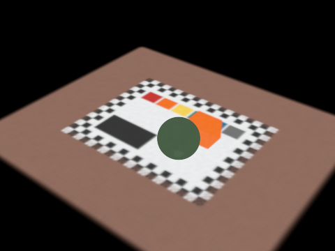
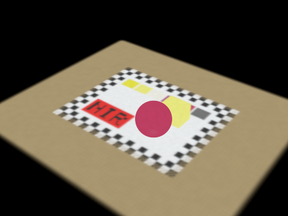
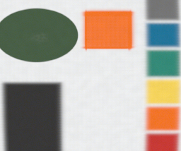
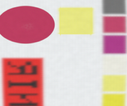
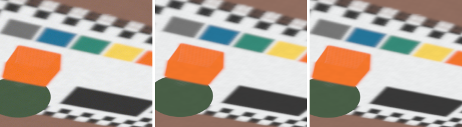
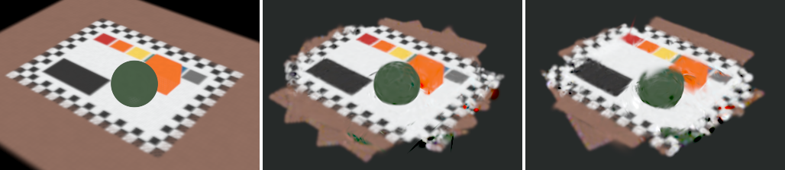
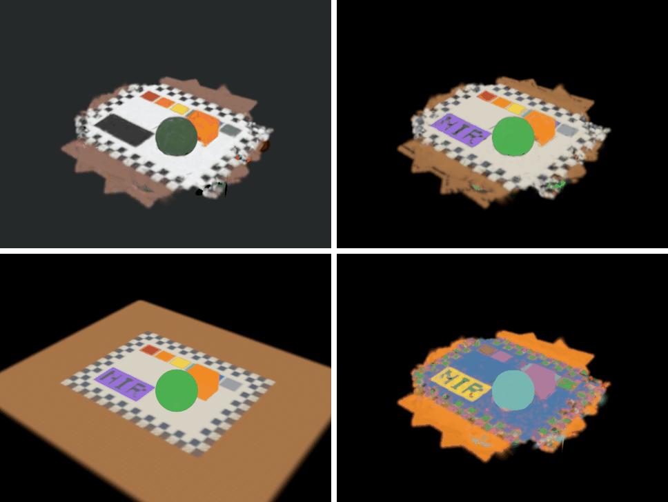

# splat: line-camera Gaussian splatting

This is the reconstruction side of the rig. The spectrograph never takes a
picture: each camera frame is one line of the scene (every pixel along the
slit, every wavelength), the scan mirror sweeps that line across the object,
and the arm moves the head between sweeps. So the training data is thousands of
one-row images, each with its own pose, and the splat has to be rendered
through a camera that has a single row of pixels.

What's here:

- a **line-camera renderer** for hyperspectral Gaussians: a CPU reference (in
  `float` or `double`) and a CUDA rasterizer that matches it, written for the
  Jetson Nano's CUDA 10.2
- a **synthetic pushbroom dataset**: a known scene with realistic spectra, scanned
  through the head's mirror geometry from `cad/`, with the kind of pose errors
  the arm will have, plus the ground truth to score against
- a **trainer** that fits the Gaussians to the lines and corrects each sweep's
  head pose at the same time, with the backward pass on the CPU or the GPU
  ([Training](#training))
- **material maps** for a trained splat: each Gaussian's material by spectral
  angle against a library, clusters found without one, and each material's
  share by linear unmixing, for the web viewer to show
  ([Material maps](#material-maps))
- tools to make and inspect datasets and to train, and unit tests that pin the
  math down

<table>
  <tr>
    <td width="50%"></td>
    <td width="50%"></td>
  </tr>
</table>

The synthetic scene, rendered by this code from its overview camera (an image
is just a stack of line cameras, one per row). Left: true color, computed from
each pixel's 500–950 nm spectrum. Right: color infrared, with 800–900 nm shown
as red, red as green and green as blue. The black panel hides the word "NIR",
printed in carbon black on a dye that is black to the eye but clear past
740 nm, and the green ball turns red because leaves reflect strongly in the
near infrared.

## What the scanner records

<table>
  <tr>
    <td width="50%"></td>
    <td width="50%"></td>
  </tr>
</table>

One sweep looking nearly straight down: 214 scan lines of 256 pixels, stacked in the
order the mirror took them. The lines are 0.29 mm apart on the board and the
pixels 0.16 mm, so round things look squashed; the renderer knows each line's
pose, so this never has to be resampled into a square-pixel image.



Why poses need refining: one oblique sweep as measured (left), the true scene
rendered at the pose the arm reported (middle), and at the true pose (right).
A head pose that is off by 3.3 mm and a quarter of a degree moves the whole
sweep.

| Lines rendered from the true scene at... | RMSE vs measured |
|---|---|
| the recorded poses | 0.186 |
| the true poses | 0.016 (the noise level) |
| the true poses, vs the noise-free lines | 0.006 |

(Reflectance units, `splat_render residual` on the default dataset. The last
row is what is left from modelling the slit as a Gaussian rather than a box.)

## The model

### A line camera

Each scan line is a pinhole camera with one row of pixels. In camera
coordinates (x along the slit, y across it, z forward, in metres):

```
u = f x / z + cu        along the slit, in pixels; pixel p covers [p, p + 1)
v = f y / z             across the slit; the slit sits at v = v_slit
```

`f` is the objective-to-slit distance measured in pixels, where a pixel is the
slit's length over the pixel count: 17.91 mm over a 5 mm slit binned to 256
pixels gives f = 917 px, so a line covers 41.9 mm at 150 mm, as in the
Optiland model. Each line also carries a
blur: `sigma_u` along the slit (pixel pitch plus optics) and `sigma_v` across it
(the 50 µm slit's width plus optics). See
[`line_camera.hpp`](include/linesplat/line_camera.hpp).

### The mirror and the virtual camera

The objective looks down the head's -Z axis into the 45° scan mirror, and the
scene sees a mirror image of the camera, the *virtual camera*. Turning the
mirror by an angle turns the virtual camera's view by twice that angle. A
reflection flips handedness, so the virtual camera's y axis is negated to keep
it a proper rotation, and `v_slit` flips sign with it.

The pose of line *l* in sweep *s* is

```
camera_in_world(l) = head_in_world(s) * virtual_camera_in_head(mirror_angle(l))
```

`head_in_world` comes from the arm (or the AprilTag board) and is fixed for the
whole sweep; the mirror angle comes from the stepper's step count. The head
geometry is `cad_head_model()` in
[`scan_model.cpp`](src/scan_model.cpp), taken from the head layout in
`cad/rig/params.py` with the Edmund 20 × 20 × 3 mm mirror. Mirror angles follow
the ROS 2 `ScanLine` message: radians, 0 at the 45° rest, right-handed about the
head's +X (shaft) axis.

Splitting the pose this way is what makes training possible. A single line says
almost nothing about where it sat across the slit, but all 214 lines of a sweep
pin down one 6-DoF head pose between them. An error in the mirror's homing needs
no parameter of its own: it moves a sweep's lines almost exactly as a small
motion of the head would (a 0.05° offset matches a rigid head correction to
about a micron), so the head pose absorbs it.

### Drawing a Gaussian on a line

This is the 3DGS projection, cut down to one row. Each 3D Gaussian is projected
to a 2D Gaussian on the image plane (the local affine, or EWA, approximation),
widened by the pixel's footprint, and then read off along the row
`v = v_slit`. A 2D Gaussian cut along a line is a 1D Gaussian, so every
(line, Gaussian) pair becomes a 1D splat:

```
S  = J W Σ Wᵀ Jᵀ                        2D covariance before blur, [a b; b c]
S' = S + diag(sigma_u², sigma_v²)       with the pixel and slit footprint
dv = v_slit - mu_v                      how far the Gaussian's centre is off the slit

u*      = mu_u + (b / c') dv            centre along the line
var_u   = det(S') / c'                  width along the line
alpha_0 = opacity * k * exp(-dv² / 2c') peak alpha on the line
k       = sqrt(det(S) / det(S'))        blur spreads alpha out but keeps its total

alpha(p) = min(0.99, alpha_0 * exp(-(p + 0.5 - u*)² / 2 var_u))
```

Pixels are then composited front to back, the same as 3DGS, with the same
cutoffs (skip alpha below 1/255, stop at transmittance 10⁻⁴). The tests check
this against an independent 2D EWA splat with explicit matrices, to 10⁻⁹.

### Spectral features

Each Gaussian stores K features instead of RGB, and a shared basis
(bands × K) turns features into a spectrum. Compositing is linear in the color,
so the renderers composite K channels and apply the basis once per pixel. The
synthetic ground truth uses K = 46 and an identity basis (the features are the
spectrum). Training can use fewer: `splat_train --basis 8` starts from the
starting scene's 8 principal spectra (an eigendecomposition of its spectra,
which K = 8 reproduces to 3·10⁻⁴ rms on the synthetic scene) and then learns
the basis along with the features. Its gradient is a sum over pixels of
dL/dband × feature, one more term in the backward pass. Fewer features means
less memory and less raster work per Gaussian, which is what the Nano needs.

## The CUDA rasterizer

It is the 3DGS tile rasterizer with the image collapsed to rows of tiles. Per
batch of lines:

| Pass | What it does |
|---|---|
| count | one thread per (line, Gaussian) pair: project, keep the pixel range if it reaches the line |
| scan | prefix sums give every visible pair a slot and every (pair, 32-pixel tile) overlap a key slot |
| emit | write the 1D splats and the keys: line and tile in the high 32 bits, depth in the low 32 |
| sort | Thrust radix sort, so each tile's splats come out front to back |
| raster | one warp per (line, tile), one lane per pixel; the warp pulls the tile's splats through shared memory 32 at a time and composites until every pixel is opaque |

Some choices, briefly:

- **Tiles of 32 pixels** make one tile one warp, so the 32 pixels share every
  load and stay in step without any synchronisation beyond the warp's.
- **Features in chunks** of 8 or 16 channels (the grid's y dimension) keep the
  accumulators in registers for any number of bands.
- **Batches of lines** cap the scratch memory: about 12 bytes per
  (line, Gaussian) pair, 200 MB at the default 2²⁴ pairs, which leaves room on
  the Nano's 4 GB shared with the CPU.
- **CUDA 10.2 limits** (JetPack 4.6, sm_53): device code is C++14, scans and
  sorts use Thrust (CUB isn't bundled before CUDA 11), only `float` atomics,
  and warp intrinsics use the `_sync` forms. The host code is C++17 that gcc 7
  builds (so no `std::filesystem`).

For training, `mse_backward()` runs the same passes, then three more: the
loss per pixel (bands, error and dL/dfeatures), the raster pass backwards (one
warp per (line, tile) again, each lane walking its pixel's list back to front
from where the forward pass stopped, the warp summing each splat's gradients
so that it costs one atomic add per value), and the projection backwards (one
thread per visible pair, into the Gaussian and the line's camera). By
default the trainer copies the scene up and the gradients down every step and
keeps Adam on the CPU, which is simple and costs a few MB of copies per step.
On TheRig the GPU's gradients agree with the CPU reference's to about 10⁻⁶
(relative).

With `--gpu-adam` the scene, its Adam moments and densification stay on the
GPU (`src/cuda/optimizer.cu`); only the 128 line cameras go up and their pose
gradients come down. On TheRig that takes a `default` step from 7.1 to 1.9 ms
(the copies were most of it), and 8 features through a learned basis
(`--basis 8`) to 1.1 ms; [`docs/nano_budget.md`](docs/nano_budget.md) has
every preset. Adam and densification run the same code as on the CPU and
give the same scene bit for bit, which the tests check:

- **Adam** uses `__fmul_rn`, `__fadd_rn` and friends, which stop the compiler
  fusing a multiply and an add into one FMA (one rounding instead of two), so
  each value rounds exactly as on the CPU.
- **Densification** needs random offsets for the split Gaussians. Instead of
  one random stream, which only a single thread could walk in order, each
  offset is a hash of (step, Gaussian, axis), so any thread can make its own.
- **New Gaussians go where the CPU puts them**: prefix sums over "kept" and
  "born" flags give each Gaussian its slot in the new arrays.

The tests run both renderers on the same lines and require all but 0.1% of
values to agree to 10⁻⁴ (float rounding can tip a splat across a cutoff).
On a 4-core cloud CPU the reference renders the default dataset (1712 lines ×
256 pixels × 46 bands) in 0.12 s. On TheRig (RTX 4070 SUPER, CUDA 13.4) the
CUDA renderer does it in 2.8 ms of GPU work, or 9.3 ms counting the copy of the
80 MB result back to the CPU, against 40 ms for the reference on the machine's
28-thread i7-14700KF. [`docs/nano_budget.md`](docs/nano_budget.md) works out
what training takes on the Nano, in memory and time per preset, and lists the
commands that measure it there.

## Training

`splat_train` fits a splat to a dataset's lines and refines the sweep poses
at the same time. Each step takes 128 random lines (every line gets a turn
before any repeats), renders them, compares them with the measured lines
(mean squared error over every pixel and band), backpropagates, and takes an
Adam step on the Gaussians and on one pose correction per sweep. The backward
pass is 3DGS's, per pixel and back to front (`backward_cpu.hpp` spells it
out); the tests check every gradient, the pose ones included, against finite
differences in `double`, and the GPU's against the CPU's.

Some choices, briefly:

- **Start on the board.** 3DGS starts from a structure-from-motion point
  cloud, which a line scanner doesn't have. Instead every recorded pixel ray
  is cut with the board's plane (z = 0), and each 1 mm cell the rays land in
  gets a Gaussian with the mean spectrum of their pixels. The ball and the box
  grow out of the board through densification.
- **Densify per line.** 3DGS clones or splits Gaussians whose screen-space
  gradient stays large, averaged per image. Here a Gaussian only gets gradient
  from the lines that cut it, so the average is per (line, Gaussian) pair,
  with the centre measured in line widths so that the threshold doesn't depend
  on the camera's resolution. Small Gaussians are cloned, ones over 1 mm split
  in two, and nearly transparent or oversized ones are pruned.
- **One pose correction per sweep.** A line on its own says almost nothing
  about where it was across the slit, but a sweep's one or two hundred lines
  share one arm pose. Each line camera's pose gradient is carried back to a
  6-DoF correction of its sweep's head pose, made in the camera's frame. A
  mirror homing error needs no parameter of its own, since a small head motion
  moves the lines the same way.
- **No sweep is held fixed.** Pinning one sweep at its recorded pose, the
  usual way to stop the whole reconstruction from drifting, stalls at 1.4 px
  on the 16-sweep scan below (against 0.47 px): that sweep's error is baked
  in, and every Gaussian has to move to match it, which gradient steps do
  badly. With every sweep free, the scene stays where the recorded poses put
  it on average and only their disagreements get corrected.

Results after the default 3000 steps, starting from the recorded poses. The
pose error is how far apart the trained and the true line cameras put points
on the board, in pixels, after the best rigid alignment of the two (moving
everything together changes nothing in the data, so no trainer can recover
it).

| Dataset | Sweeps | Pose error: recorded → trained | Gaussians | Time, 4-core CPU |
|---|---|---|---|---|
| `small` (128 px, 24 bands) | 6 | 5.5 → 1.09 px | 9,994 | 43 s |
| `small --sweeps 16` | 16 | 5.2 → 0.47 px | 12,452 | 54 s |
| `default` (256 px, 46 bands) | 8 | 10.6 → 2.0 px | 11,205 | 101 s |
| `default --sweeps 16` | 16 | 10.9 → 0.97 px | 12,938 | 108 s |

A pixel covers 0.33 mm of the board at 128 px and 0.16 mm at 256 px, so both
16-sweep runs line the sweeps up to about 0.15 mm. Every run renders the
measured lines to about their noise (RMSE 0.015 to 0.019, where the true scene
at the true poses scores 0.016). Runs differ by about 0.01 px from one to the
next, since threads add up the gradients in a different order each time. On
TheRig the 16-sweep runs reach the same pose errors in 10 s (`small`) and
16 s (`default`) on the GPU, and the `small` one in 24 s on the CPU.



The true scene (left) and splats trained on the default dataset's lines: from
16 sweeps (middle) and from the default 8 (right). Only what the scans saw
comes back, so the table frays at the edges.

What this says for the rig:

- **Scan many sweeps from all around.** With 6 or 8 sweeps the ball and the
  box are seen from too few directions: the trainer paints them onto the
  board, and each sweep's pose bends to fit its own view. With 16 sweeps the
  pose error is half or less.
- **Some error is the geometry's, not the trainer's.** Holding the true scene
  fixed and refining only the poses stops at about 0.3 px (at 128 px), even
  with noise-free lines and perfect mirror angles. Turning a sweep slightly
  about the board while shifting it to keep the board in place barely changes
  what a narrow fan sees of a flat board, so the loss is nearly flat in that
  direction. A target with textured relief instead of a flat board should
  pin it down better (not yet tried).

## Material maps

Every Gaussian carries a whole spectrum, so a trained splat can say what each
part of the scene is made of, which a color camera can't: the black panel's
dye and its carbon-black letters look the same to the eye but not past
740 nm, and green paint looks like a leaf but has no red edge.
`splat_materials` works that out for each Gaussian and writes it into the
viewer's file, where the [viewer](../viewer/) shows it:

```bash
./splat_materials synth.lsplat synth.lsplat [--library builtin|FILE.csv] [--truth DATASET] [--png DIR]
```

It makes three maps, from the spectra as the viewer decodes them:

- **Library match, by spectral angle.** Think of a spectrum as an arrow with
  one coordinate per band (46 here). The angle between two such arrows,
  acos(a·b / |a||b|), depends only on the spectra's shapes, not on how bright
  they are, so a white sheet in light shadow still matches white paper. Each
  Gaussian gets the library material at the smallest angle, or no match if
  every one is more than 10° away (`--max-angle`). Brightness can't be
  ignored altogether, though: carbon black, 18% gray and white paper are all
  flat, the same shape. So a material is only a candidate if its spectrum,
  scaled to fit the Gaussian's, needs a scale between ½ and 2
  (`--brightness`).
- **Clusters, by k-means.** Without any library: k-means sorts the spectra
  into 12 groups (`--clusters`), each as close as it can be to its group's
  mean, weighting each Gaussian by its opacity so that faint floaters don't
  pull the means. Each cluster is then named after the library material
  nearest its mean, if one is within the angle. It's how you'd look at a scene
  with materials you have no spectra for.
- **Abundances, by linear unmixing.** A Gaussian that straddles a checker
  edge sees both squares, and its spectrum is a mix of theirs. Unmixing finds
  the shares a₁…a_E, none negative and adding up to 1, that make
  a₁s₁ + … + a_E s_E closest to the spectrum, where s₁…s_E are the
  *endmembers*: the library's spectra, or with `--endmembers clusters` the
  cluster means. That is fully constrained least squares (Heinz and Chang,
  2001): non-negative least squares (Lawson and Hanson's active-set method)
  with one heavily weighted extra row that asks the shares to sum to 1.

The library is the synthetic scene's 11 materials unless `--library` names a
CSV file: a header row `nm,<name>,<name>,...`, one row per wavelength, and
optionally a `color` row of `#rrggbb` map colors. For the rig that would be
spectra measured with the spectrometer itself, from samples of what will be
scanned.



The splat trained from 16 synthetic sweeps, from the viewer's opening camera:
true color, the library match, the true materials, and the k-means clusters.
The word NIR, invisible in true color, is in the library match because the
letters' carbon black and the panel's dye have different spectra past 740 nm.

`--truth` scores the maps against a synthetic dataset's ground truth. Each
Gaussian counts as the material of the nearest true Gaussian within 1.5 mm,
and the material map rendered from the opening camera (480 × 360) is scored
against the true materials rendered the same way, on the pixels that one
material covers at least 90% of and the splat covers at least 90% of. For the
viewer's two samples:

| | Ground truth | Trained from 16 sweeps |
|---|---|---|
| Gaussians labelled right | 100% | 71.7% (74.5% weighted by opacity) |
| Map pixels labelled right | 100% of 80,482 | 97.1% of 21,074 |
| Gaussians with no match | 0% | 13.9% |
| Largest abundance is the true material: Gaussians, map pixels | 100%, 100% | 80.9%, 95.6% |
| The true material's mean abundance: Gaussians, map pixels | 0.98, 0.95 | 0.72, 0.84 |
| Cluster purity, adjusted Rand index | 99.3%, 0.66 | 77.2%, 0.36 |

The map is much better than the Gaussians because what you see is mostly the
large, opaque Gaussians, and those have clean spectra. Training also leaves
small, faint Gaussians that each fix up a little of a few lines, and their
spectra can be anything; most of the misses are those, with no match rather
than the wrong one. The weakest material is carbon black (11% of its
Gaussians, 70% of its pixels): the checker squares are 4 mm and the splat
blurs their edges into the white squares, so a black square's spectrum comes
out too bright, and 40% of its Gaussians are left unmatched. *Purity* is the share of Gaussians in a
cluster whose commonest true material is theirs; the *adjusted Rand index* is
1 when the clusters are exactly the materials and 0 for a random split. Even
on the ground truth it is only 0.66, because k-means with 12 clusters for 11
materials gives the big ones (paper, wood) two clusters each and merges the
small blue patch into another: clusters find what differs, not what the names
are.

### On the simulator

The [instrument simulator](../sim/) renders whole scans of scenes whose
materials are known, through the arm, the mirror, the spectrograph and the
camera, so the maps can be scored on data that went through `hsical`'s
calibration, `tools/scan_to_dataset.py` and `splat_train` like a real scan
will. `tools/sim_material_truth.py` rebuilds the scene and writes the library
(the simulator's 13 materials, PTFE and the rare-earth tile among them) and
the truth three ways: each Gaussian's material (that of the nearest surface),
the opening view's, and what each pixel of each scan line saw:

```bash
# From the repo root; build/ is ignored by git
(cd sim && python -m hsisim scan ../build/sim --plan ring --scene board)
(cd calibration && python -m hsical calibrate ../build/sim/calibration -o ../build/sim/cal)
python3 splat/tools/scan_to_dataset.py build/sim build/sim_ds --calibration build/sim/cal
cd build/splat
./splat_train ../sim_ds ../sim_train
./splat_export ../sim_train/scene ../sim.lsplat --dataset ../sim_ds --poses ../sim_train/sweep_head_pose.npy
python3 ../../splat/tools/sim_material_truth.py ../sim ../sim_ds ../sim.lsplat ../sim_truth \
    --poses ../sim_train/sweep_head_pose.npy
./splat_materials ../sim.lsplat ../sim.lsplat --library ../sim_truth/library.csv \
    --truth-labels ../sim_truth/labels.npy --truth-map ../sim_truth/view.npy \
    --dataset ../sim_ds --poses ../sim_train/sweep_head_pose.npy --truth-lines ../sim_truth/lines.npy
```

A trained splat can sit anywhere: moving the scene and every pose together
changes nothing in the lines. These splats sat 2.2 to 2.4 mm low (the
simulator's board and plate are 2 mm thick, and training starts every
Gaussian at z = 0), so the helper first moves each one back by the rigid
motion that best takes its trained sweep poses onto the true ones. The scan
lines are the fairest test, because a trained splat reproduces its lines
whatever its shape: rendering the material map through each line camera
scores the materials alone. The Gaussians and the opening view also score the
shape.

| Scene, scan | Board, `ring` (4 views) | Relief, `ring` (4 views) | Relief, 16 views |
|---|---|---|---|
| Lines | 428 | 428 | 1,712 |
| Measured line pixels, matched directly | 98.5% | 96.9% | 96.8% |
| The splat's line pixels labelled right | 98.6% | 85.9% | 93.9% |
| Largest abundance right, line pixels | 98.0% | 71.0% | 82.4% |
| Map pixels labelled right | 87.8% | 51.2% | 58.3% |
| Gaussians labelled right | 63.8% | 17.4% | 17.0% |
| Training on a 4-core CPU | 3,000 steps, 128 s, RMSE 0.008 | 3,000 steps, 224 s, RMSE 0.014 | 9,000 steps, 19 min, RMSE 0.015 |

The first row needs no splat: each measured pixel's spectrum matched against
the library as `splat_materials` matches a Gaussian's. It is what the
instrument and its calibration allow. Most of the misses are white paper
taken for PTFE, both nearly flat and bright, so only the paper's slight
slope tells them apart; the rest are carbon black, whose 4% reflectance
leaves the least signal over the noise. On the flat board the splat's maps,
seen along the lines, are as good as that.

The relief is harder. From four views the trainer flattens its 1 to 12 mm
pillars onto the plate. Sixteen views (a plan from `make_plan --tilts 0 15 25
--azimuths 0 45 90 135 180 225 270 315`; 3,000 steps left it at RMSE 0.028
and 90.2%, so it got 9,000) bring the pillars up and the lines to within 3
points of the measured ones, but the pillars' shape stays rough, so in the
opening view a material often lands beside where it really is. And most of
its Gaussians match nothing: 39% of them have a negative reflectance
somewhere, which no material has, and 97% of those go unmatched. The trainer
lets a Gaussian go negative where that corrects the blend of the ones around
it, so the blend is right while its own spectrum isn't (6% of the synthetic
splat's Gaussians and 13% of the board's do the same). Keeping the features
non-negative in training is the obvious next step for per-Gaussian maps.

## Dataset format

A dataset is a directory. The synthetic generator writes it, and the capture
side will write the same thing from the rig, so the trainer can't tell the two
apart.

```
dataset.json              format "linesplat-dataset", version 1: intrinsics, head
                          model, wavelengths (nm), file names, free-form metadata
lines.npy                 float32 [L, W, B]  one spectrum per pixel per line
line_sweep.npy            int32   [L]        which sweep each line belongs to
line_mirror_angle.npy     float64 [L]        mirror angle per line (rad)
sweep_head_pose.npy       float64 [S, 7]     head -> world per sweep:
                                             tx, ty, tz, qw, qx, qy, qz (m)
gt/                       synthetic only: scene/, true poses and mirror angles,
                          noise-free lines
preview/                  true color and CIR quick looks of each sweep
```

The ROS 2 side's `ScanLinePose` message maps straight onto this: `mirror_angle`
is `line_mirror_angle`, each `sweep_id` becomes one sweep index in `line_sweep`,
and `head_pose` (constant while the arm holds still) is that sweep's
`sweep_head_pose`, as long as its head frame is
the CAD's: origin on the wrist-roll horn face, +Z away from the wrist, +Y out
of the scan window, +X along the mirror shaft. Pixel 0 is at the camera's -x
end of the slit, which is the head's -X end; a sensor that reads the other way
gets flipped on load. Everything is in metres and radians.

## The synthetic dataset

- **Scene** (9741 Gaussians, 1 mm apart): an 80 × 64 mm white board with a
  4 mm checker border, six paint patches, the hidden-word panel, an 18 mm
  leaf-green ball and a 12 × 10 × 10 mm orange box, on a wooden table. The
  spectra are analytic curves shaped like the real materials.
- **Scan**: 8 sweeps from 150 mm, one looking nearly straight down and seven oblique
  ones (48° and 62° elevation) around the board. The mirror covers ±6° (a 24°,
  63 mm fan), one 1/32 microstep of the NEMA 8 per line.
- **Errors**: each sweep's head pose is off by 1 mm and 0.3° per axis (1σ), the
  mirror's homing by 0.05°, and each line's microstep by 0.005°. The values get
  read noise and shot noise (σ = 0.02 on white).
- **Slit**: the measured lines integrate the slit's width as a box (5 sub-lines
  per line); the renderer models it as a Gaussian of the same width.

| Preset | Pixels | Bands | Sweeps | Lines | `lines.npy` |
|---|---|---|---|---|---|
| `tiny` | 64 | 12 | 3 | 162 | 0.5 MB |
| `small` | 128 | 24 | 6 | 642 | 7.5 MB |
| `default` | 256 | 46 | 8 | 1712 | 77 MB |
| `full` | 512 | 91 | 12 | 2568 | 456 MB |

`tiny` and `small` take 4 and 2 microsteps per line; `full` also packs the
Gaussians 0.7 mm apart.

## Building

You need CMake 3.18 or newer and a C++17 compiler. The CUDA rasterizer is built
when CMake finds `nvcc`; without it you get the CPU renderer only.
[nlohmann/json](https://github.com/nlohmann/json) comes from the system if it
has 3.2 or newer, otherwise CMake downloads it.

```bash
# Linux, from the repo root
cmake -S splat -B build/splat -DCMAKE_BUILD_TYPE=Release
cmake --build build/splat -j
build/splat/splat_tests
```

On a desktop GPU the build targets the card in the machine (with CMake 3.24 or
newer; older ones need `-DCMAKE_CUDA_ARCHITECTURES`, such as 86 for an RTX 30
series card). For the
**Jetson Nano** (JetPack 4.6: CUDA 10.2, gcc 7), install a newer CMake first,
since JetPack's 3.10 is too old:

```bash
python3 -m pip install --user --upgrade pip   # JetPack's pip is too old for the cmake wheels
python3 -m pip install --user cmake           # then put ~/.local/bin first on PATH
cmake -S splat -B build/splat -DCMAKE_BUILD_TYPE=Release \
      -DCMAKE_CUDA_COMPILER=/usr/local/cuda/bin/nvcc -DCMAKE_CUDA_ARCHITECTURES=53
cmake --build build/splat -j4
```

Or let [`jetson/splat.sh`](../jetson/README.md) build and run it in a container with JetPack's CUDA.

On **Windows** with Visual Studio 2022 or newer and the CUDA toolkit, from an
x64 Native Tools Command Prompt (which puts Visual Studio's own CMake on the
PATH). This is tested with Visual Studio 2026 and CUDA 13.4:

```bat
cmake -S splat -B build\splat
cmake --build build\splat --config Release
build\splat\Release\splat_tests.exe
```

## Tools

Run them from the build directory, so the datasets stay out of git (`build/`
is ignored). Each tool prints its flags when run with no arguments.

```bash
cd build/splat

# Make a dataset: on the GPU if there is one, --preset tiny|small|default|full,
# --sweeps 16 for more views, --no-errors for perfect poses (--errors 0.5 for half)
./splat_synth synth --preset small

# Train a splat and refine the sweep poses (on the GPU if there is one, --cpu
# to force the CPU); for synthetic data it reports the pose error before and after
./splat_train synth synth/train
# ... everything on the GPU, 8 features through a learned basis, and the GPU
# time and memory per pass
./splat_train synth synth/train8 --gpu-adam --basis 8 --profile

# Time and memory per preset and mode, as Markdown tables (docs/nano_budget.md)
python3 ../../splat/tools/nano_budget.py --bin . --presets small,default

# CPU vs GPU on every line, with timings
./splat_render compare synth

# How well a scene explains the lines, at the recorded and the true poses;
# --png writes measured | recorded | true images per sweep
./splat_render residual synth --png synth/residual

# True color and CIR images of a scene from the overview camera
./splat_render view synth/gt/scene synth/view

# A scan from the rig (scan_sweep with line_camera recording) as a dataset; needs numpy only
python3 ../../splat/tools/scan_to_dataset.py ~/so101_scan/scans/<scan> rig_scan

# Pack a trained splat into one file for the web viewer in viewer/
./splat_export synth/train/scene synth.lsplat --dataset synth --poses synth/train/sweep_head_pose.npy

# Add material maps to it, scored against the truth; --png writes them as images
./splat_materials synth.lsplat synth.lsplat --truth synth --png synth/materials

# The true materials behind a splat of a simulator scan, to score its maps
# (with sim/requirements.txt; Material maps has the whole chain)
python3 ../../splat/tools/sim_material_truth.py sim_out sim_ds sim.lsplat sim_truth --poses sim_train/sweep_head_pose.npy
```

## Code map

```
include/linesplat/
├── math.hpp              small vector, matrix and quaternion helpers, host and device
├── line_camera.hpp       the line camera and project_to_line(): Gaussian -> 1D splat
├── scene.hpp             GaussianScene: shapes, opacities, spectral features, basis
├── scan_model.hpp        poses, the scan mirror, the CAD head, intrinsics from the optics
├── render_cpu.hpp        reference renderer, float or double
├── cuda_rasterizer.hpp   the CUDA renderer and backward pass, and CudaSceneOptimizer
├── gradients.hpp         backward of the projection and the Gaussian parameters, host and device
├── backward_cpu.hpp      reference backward pass: lines -> loss -> scene and camera gradients
├── trainer.hpp           Adam, densification, per-sweep poses, the pose error metric
├── densify.hpp           densification's rules and the split, shared by the CPU and GPU
├── dataset.hpp           the dataset format above
├── synthetic.hpp         the synthetic scene and scan
├── spectra.hpp           material spectra, true color (CIE 1931) and CIR
├── lsplat.hpp            the web viewer's .lsplat file: read, write, pack a scene
├── materials.hpp         spectral angle, k-means, unmixing, spectral libraries
└── preview.hpp, png.hpp, npy.hpp, rng.hpp, util.hpp
src/                      a .cpp per header
src/cuda/
├── rasterizer.cu         the passes, forward and backward
├── optimizer.cu          Adam and densification on the GPU (--gpu-adam)
└── cuda_common.cuh, rasterizer_impl.cuh   buffers, timers and the GPU state
tools/                    splat_synth, splat_render, splat_train, splat_export, splat_materials,
                          scan_to_dataset.py, nano_budget.py, sim_material_truth.py
tests/                    one file per topic; test_cuda skips without a GPU
docs/                     nano_budget.md, figures
```

## Next steps

1. **Measure training on the Nano** with the commands in
   [`docs/nano_budget.md`](docs/nano_budget.md), and fill in its measured
   column; the page lists what to try first if a pass is slower than
   expected.
2. **Real data**: `tools/scan_to_dataset.py` converts a scan folder from the
   rig (ros2/so101_scan_camera bins its lines with the calibration's maps);
   what is left is first light and a real scan.
3. **Pick K for real spectra.** `--basis 8` matches the full spectrum on the
   synthetic scene, whose spectra are smooth curves; real materials and the
   spectrograph's noise may want 10 or 12.
4. **Non-negative spectra in training**, so that each Gaussian's own spectrum
   means something and the material maps can label it
   ([On the simulator](#on-the-simulator) says why).
