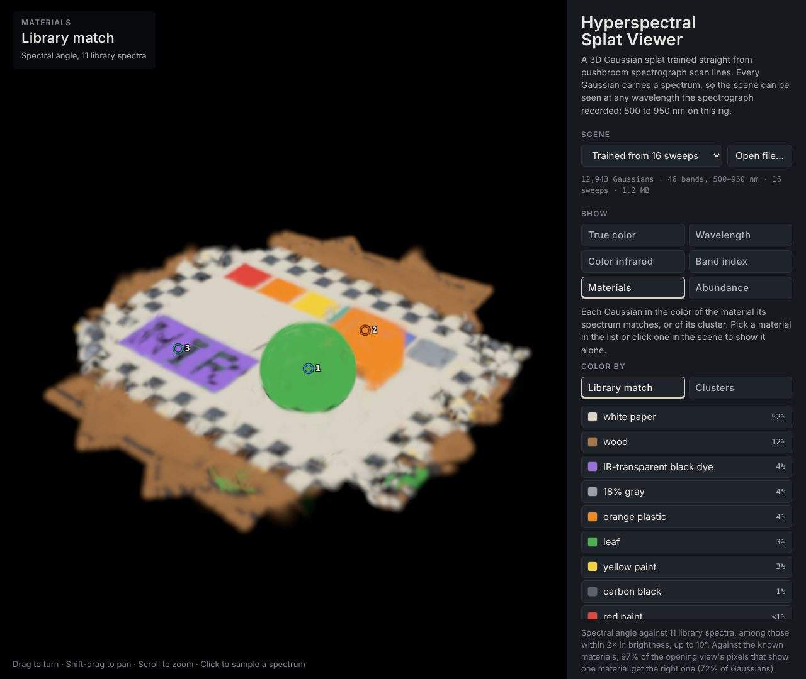

# viewer: a hyperspectral splat in the browser

A web page for looking at what [`splat/`](../splat/) trains. Every Gaussian
in the splat carries a spectrum, so the page can show the scene at any single
wavelength, as a band average, in true color computed from the spectra, in
color infrared, or as a normalized difference of two bands, and it plots the
full spectrum of any point you click. For a splat that
[`splat_materials`](../splat/README.md#material-maps) has mapped, it also
colors each Gaussian by the material its spectrum matches and maps how much
of each material it is made of. It is plain HTML, JavaScript and WebGL2 with
no build step, and it comes with two scenes from the synthetic dataset.


The splat trained from 16 synthetic sweeps, in color infrared. The ball's
leaf spectrum and the black panel's dye both rise past 700 nm, so both turn
red, and the word printed in carbon black on the panel shows up.



The same splat in the Materials view: each Gaussian in the color of the
library material its spectrum matches. The panel's dye and the letters'
carbon black look alike to the eye, but their spectra don't.

## Using it

Serve this folder and open it:

```bash
python3 -m http.server -d viewer 8000     # then open http://localhost:8000/
```

It needs a server, even a local one: browsers won't run a page's modules or
let it load its samples when it's opened straight from disk.
`index.html#truth` opens the ground truth instead of the trained splat, and
*Open file* (or dropping a file on the image) opens your own.

- **Drag** to turn, **shift-drag** or right-drag to pan, **scroll** to zoom;
  on a touch screen, drag and pinch. The arrow keys, shift-arrows and + and −
  do the same when the image has focus.
- **Click** the scene to sample the spectrum there (up to four at once). The
  page samples three points of the synthetic scene to start. Hover the chart
  to read values, click it to show that wavelength, and open *Values by band*
  for a table.
- **Show** picks the view:
  - *True color*: what the eye would see under equal-energy light, from the
    CIE 1931 color matching functions, as `splat_render view` draws it.
  - *Wavelength*: one wavelength in gray, or the mean over a band up to
    100 nm wide. *Sweep* runs it from one end of the spectrum to the other.
  - *Color infrared*: 800–900 nm as red, 620–680 nm as green and
    520–580 nm as blue, the same bands as the C++ previews.
  - *Band index*: (A − B) / (A + B) for two wavelengths, blue below zero and
    red above. A at 800 nm and B at 670 nm makes it NDVI.
  - *Materials* (files with material maps): each Gaussian in the color of the
    library material its spectrum matches, or with *Clusters* of the k-means
    cluster it falls in. Gaussians that match nothing are a dim gray. The list
    beside it gives each material's share of the Gaussians; pick one there, or
    click it in the scene, to show it alone, with its library spectrum dashed
    on the chart. The sampled points read the material covering most of them.
  - *Abundance* (files with material maps): how much of one endmember each
    Gaussian is, from 0 (dark violet) to 1 (yellow), from linear unmixing.
    The sampled points read the same share.
- **Scan sweeps** draws each sweep's fan: where its lines start (the
  camera's image in the scan mirror) and where the first and the last line
  land on the board.

## The samples

| File | What it is | Size |
|---|---|---|
| `data/trained-16-sweeps.lsplat` | 12,943 Gaussians trained by `splat_train` on 3,424 lines (16 sweeps of 256 px by 46 bands, 500–950 nm), with the poses it refined; the pose error went from 10.9 px to 0.97 px | 1.2 MB |
| `data/ground-truth.lsplat.gz` | the 9,741 Gaussians the lines were rendered from | 125 KB |

Both come from `splat_synth`'s default scene with `--sweeps 16`, and both
carry material maps, scored against the scene's true materials: 97% of the
trained splat's map pixels get the right material (72% of its Gaussians), and
all of the ground truth's. To remake them, from `build/splat` after building
`splat/`:

```bash
./splat_synth synth16 --preset default --sweeps 16
./splat_train synth16 synth16/train
./splat_export synth16/train/scene trained.lsplat --dataset synth16 \
    --poses synth16/train/sweep_head_pose.npy --title "Trained from 16 sweeps" \
    --reference reference.json
./splat_export synth16/gt/scene truth.lsplat --dataset synth16 \
    --poses synth16/gt/sweep_head_pose.npy --title "Ground truth"
./splat_materials trained.lsplat trained.lsplat --truth synth16
./splat_materials truth.lsplat truth.lsplat --truth synth16
gzip -9 -n truth.lsplat
```

then copy `trained.lsplat` to `data/trained-16-sweeps.lsplat`,
`truth.lsplat.gz` to `data/ground-truth.lsplat.gz` and `reference.json` to
`test/`. A splat retrained elsewhere (on a GPU, say) will differ in detail,
and needs its own reference.

## Your own splats

`splat_export` packs any scene directory, such as `splat_train`'s
`OUT_DIR/scene`:

```bash
./splat_export SCENE OUT.lsplat [--dataset DIR] [--poses POSES.npy] [--title TEXT]
```

`--dataset` adds the wavelengths and the sweep fans (from `--poses` if given,
else the dataset's recorded poses); without it, the bands are spread evenly
over 500–950 nm. It prints how far the packed scene renders from the original
(2e-4 RMS in reflectance or less for the samples). The page opens `.lsplat`
files and gzipped ones. `splat_materials OUT.lsplat OUT.lsplat` then adds the
material maps; [splat's README](../splat/README.md#material-maps) says how
they are made and how to give it your own library of spectra.

## How it draws

The renderer follows the C++ one (`line_camera.hpp`, `render_cpu.cpp`), with
an image treated as a stack of line cameras, one per row, as `splat_render
view` does:

- Each Gaussian is projected with the 3DGS Jacobian, clamped at 1.3 times the
  half field of view, plus a pixel-wide blur (variance 1/12 px²), with its
  opacity scaled to keep its total. Alpha below 1/255 is dropped and alpha is
  capped at 0.99. Along each row, a splat stops 3 sigma from its centre, as
  the line renderer's 1D splats do.
- WebGL2 draws a quad per Gaussian, sorted by depth on the CPU (a radix sort;
  ties keep the file order), back to front with premultiplied alpha into a
  32-bit float image (16-bit where the GPU can't blend 32-bit floats). The
  background spectrum fills what's left.
- A view is three weighted sums of the bands: for one wavelength, the weights
  of linear interpolation between band centres; for true color, the CIE curves
  sampled every 2 nm. They are folded through the basis onto the features, so
  the vertex shader takes one dot product per four features, and changing the
  view only changes the weights.
- A click composites that pixel band by band on the CPU, front to back,
  exactly as `render_cpu` does (`js/probe.js`).
- The material views keep the same drawing. A second texture holds each
  Gaussian's material, cluster and abundances; the vertex shader swaps its
  color for the material's palette color, or for one abundance in all three
  channels, which the display step divides by the coverage and maps to a
  color scale. The probe blends material shares the same way, so a point's
  shares add up to its coverage.

One difference is deliberate: the C++ renderer stops a pixel at the Gaussian
that would leave less than 1e-4 of its light, and leaves that Gaussian out.
Drawing back to front can't stop early, so where a pixel turns opaque the
WebGL image keeps up to 1% more of the last Gaussians behind.

## The file format

A `.lsplat` file (format `linesplat-view`, version 1) is:

| Bytes | Contents |
|---|---|
| 0–3 | `LSPV` |
| 4–7 | version, uint32 little-endian |
| 8–11 | length of the JSON header, a multiple of 4 |
| header | JSON, padded with spaces |
| arrays | little-endian, each starting on a 4-byte boundary, at `blocks[name].offset` bytes after the header |

| Array | Type | Shape | Decodes to |
|---|---|---|---|
| `means` | float32 | N × 3 | position in metres |
| `log_scales` | uint16 | N × 3 | lo + q (hi − lo) / 65535, with `range: [lo, hi]` in the block |
| `rotations` | int16 | N × 4 | unit quaternion (w, x, y, z) × 32767, w ≥ 0 |
| `opacity` | uint8 | N | q / 255 |
| `feature_range` | float32 | N × 2 | offset and scale of that Gaussian's features |
| `features` | uint8 | N × K | offset + scale q / 255 |

That is 35 + K bytes a Gaussian. Each Gaussian's features are quantized
between its own minimum and maximum, which keeps the detail of a dark or flat
spectrum. The header also holds `count`, `num_features`, `num_bands`,
`wavelengths_nm`, `basis` (`"identity"` or B rows of K), the `background`
features, `values` (`reflectance`), the default `view` (`eye`, `target`,
`up`, `fov_deg` across the shorter side of the image), `sweeps` (`apex`,
four board `corners`, `lines`) and `source` (where the scene came from). A
band's value is the basis row times the features.

`splat_materials` appends four more arrays and a `materials` entry to the
header. A file without them still opens, without the material views.

| Array | Type | Shape | Decodes to |
|---|---|---|---|
| `material_label` | uint8 | N | the library material its spectrum matches, 255 for none |
| `material_angle` | uint8 | N | the spectral angle to it, in `labels.angle_step_deg` (0.1°); 255 for none |
| `cluster` | uint8 | N | its k-means cluster |
| `abundances` | uint8 | N × E | each endmember's share × 255; the shares sum to 1 |

`materials` holds `library.classes` (each material's `name`, `color`,
`spectrum` and `count`), `labels` (the method, `max_angle_deg`,
`brightness_window`), `clusters.list` (each cluster's `color`, mean
`spectrum`, `count`, and the library material `nearest` it with its
`angle_deg`, or −1), `unmixing.endmembers` (a library `class`, or a cluster
with its `spectrum`) and, when it was scored against the truth, `score`.

A file may also be gzipped, and either form may be base64 text, for hosts
that only serve text.

## Tests

The checks in `test/` compare the page's code with the C++ renderer on the
trained sample: the file reader, the color weights (to 1e-8), the CPU probe
(every band at 96 pixels of two cameras agrees to the reference's 4 decimals),
the WebGL2 image (against the probe at 15,600 pixels, and against the C++
renderer allowing for the early stop above), the draw order, and the page
itself at a desktop and a phone size. For the material maps they check the
arrays against the header's counts, that a file without them still opens,
that a point's material shares add up to its coverage, and that the WebGL2
material, cluster, highlight and abundance images match the probe's shares;
on the page, the legend, picking from the list and from the
scene, the clusters, the abundance view and a file without maps. With Node 18
or newer:

```bash
cd viewer
npm install
npx playwright install chromium    # once
npm test                           # node test/run.mjs --screenshots DIR also saves screenshots
```

Or serve the folder and open `test/index.html` in any browser to run the
comparisons there.

## Putting it online

The page needs nothing but a static file server. GitHub Pages serves it with
both samples at
[corabeanz.github.io/linescan-hyperspectral-splatting/viewer/](https://corabeanz.github.io/linescan-hyperspectral-splatting/viewer/),
under the project's [front page](https://corabeanz.github.io/linescan-hyperspectral-splatting/).
The [pages workflow](../.github/workflows/pages.yml) builds the site with
[`docs/site/build.sh`](../docs/site/build.sh), opens it in headless Chromium and
deploys it whenever `viewer/` changes on `main`.

## Code map

```
index.html          the page and its styles
js/
├── main.js         loading scenes, the controls, orbiting, sampling, the material views
├── format.js       reads .lsplat files (and gzipped ones), material maps included
├── renderer.js     the WebGL2 splat renderer
├── probe.js        one pixel's full spectrum on the CPU, as render_cpu does it
├── spectral.js     wavelengths, bands, true color and CIR as weights over the bands
├── camera.js       the pinhole camera (look_at's axes) and the orbit controls
└── chart.js        the spectrum chart
data/               the two sample scenes
test/               the checks: index.html and tests.js run in a browser, run.mjs drives them
```

`splat_export` and `splat_materials` are in [`splat/tools/`](../splat/tools/).
